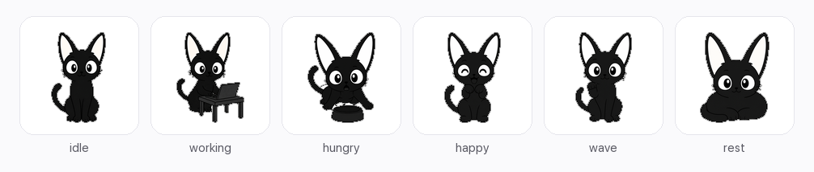

# Tokcat

<p align="center">
  
</p>

<p align="center"><sub>Tokcat V3 — idle · working · hungry · happy · wave · rest</sub></p>

**Realtime multi-agent token usage & cost monitoring in the macOS menu bar — local-only, no upload.**  
Optional desktop pixel pet fed by the same usage.

[English](README.md) | [中文](README.zh-CN.md)

[](LICENSE)
[](#requirements)
[](https://github.com/SelinLee/tokcat/releases)

<p align="center">
  
</p>

<p align="center"><sub>Menu bar live strip — network · token rate · spend rate, next to the cat icon.</sub></p>

---

## Why Tokcat

If you hop between Claude Code, Codex, Cursor and friends, costs scatter across tools.  
Tokcat **only reads local agent logs** on your Mac (no cloud hook, no API-key upload), unifies them into token events, and shows:

| You care about | What you see |
|----------------|--------------|
| **Live rates** | Menu bar: `tok/s`, `$/h`, optional CPU / GPU / mem / network |
| **Today & total** | Today’s tokens & cost, cumulative spend |
| **Who spent it** | Agent · model · optional **provider / relay** (CC Switch) |
| **Trends** | Day / week / month charts; group by provider, model, or agent |
| **Local pricing** | Editable rate table + reported real prices when available |
| **Optional pet** | Tokcat V3 grows on usage — loot, bag, codex |

> The pet is an optional shell: **tokens → stats → (optional) feed the cat**.  
> Monitoring and stats work fully without the pet.

---

## Screenshots

### Live menu bar & panel

| Menu bar strip | Dropdown panel |
|----------------|----------------|
|  |  |

- Cat icon with state (idle / working / resting / reviewing…)
- Side metrics: network, **token rate**, **spend rate**
- Panel: system strip, pet vitals, active agent + model, today / total cost, recent events
- Shortcuts: main window · pet · settings · quit

### Usage dashboard


- Period: **Day / Week / Month**
- Group by: **Provider (relay)** · **Model** · **Agent**
- Metric: **Tokens** or **Cost**
- Summary cards (totals, in/out split, estimate ratio) + trend chart + breakdown table

### Multi-agent sources


Toggle each adapter in **Settings → Agent**. Sources only poll **local** logs / state files.

| Source | What it reads |
|--------|----------------|
| **Claude Code** | `~/.claude/projects/**/*.jsonl` session logs |
| **Codex CLI** | `~/.codex/sessions/**/rollout-*.json` `token_count` events |
| **OpenClaw** | trajectory `model.completed` events |
| **WorkBuddy** | local generation usage traces |
| **Kimi** | Desktop `wire.jsonl` usage records |
| **Cursor** | local state / logs (shown when data exists) |
| **Gemini CLI** | `~/.gemini` session logs (shown when data exists) |
| **CC Switch** | local proxy DB → **relay attribution, reported cost, multiplier** |

New adapters track from the **end of the file** so first launch does not backfill huge histories.

### Optional pixel pet

| Character | Inventory | Codex |
|-----------|-----------|-------|
|  |  |  |

- **Character**: level, series, streak, mood / satiety / three stats, animation preview  
- **Inventory**: loadout slots (hat / glasses / cape / held / aura) + bag filters  
- **Codex**: skins & gear discovery progress; equip owned items from the codex  

Main window tabs: **Stats · Pet · Bag · Codex · Settings**.

---

## 60-second tour

1. Install and open Tokcat (cat appears in the menu bar)  
2. Use Claude Code / Codex / Cursor as usual  
3. Watch **tok/s · $/h** beside the icon; click for today’s summary  
4. Open **Main window → Stats** for day / week / month charts  

Local DB only: `~/Library/Application Support/TokenCat/tokencat.sqlite3`

---

## Feature map

### 1. Live monitoring (menu bar)
- Custom Tokcat icon; expressions track agent throughput / pet mood  
- Optional metrics: CPU, GPU, memory, network, thermal, **token rate**, **spend rate**  
- Dropdown: agent + model, speed, today & total cost, recent events, pet vitals  

### 2. Stats & rates (main window)
- Day / week / month; group by provider / model / agent; tokens ↔ cost  
- Async aggregation + cache so period switches stay responsive  
- **Settings → Rates**: model unit prices; pairs with CC Switch reported prices  

### 3. Desktop pet (optional)
- Default **pixel Tokcat** (idle / work / review / wait / fail / happy / sad / sleepy / hungry / rest / wave / jump…)  
- Also: block cat / pink cat / custom USDZ  
- Usage-driven growth: level, smarts / stability / feel, loot drops, bag & codex  
- SFX **off by default**  

### 4. Privacy
- **The app itself makes no network requests**  
- Read-only local logs & system metrics  
- No account, no cloud sync, no usage upload  

---

## Requirements

- macOS 13 Ventura or later  
- Dev build: Xcode 15+ / Swift 5.10+  

---

## Install

Download from [GitHub Releases](https://github.com/SelinLee/tokcat/releases):

### Recommended: DMG
1. Open `Tokcat-*-macos.dmg`  
2. Drag `Tokcat.app` into **Applications**  
3. **First launch**: right-click → **Open** (ad-hoc signed; one-time Gatekeeper bypass)  

### Alternative: Zip
1. Download `Tokcat-*-macos.zip` and unzip → `Tokcat.app`  
2. Drag into **Applications**  
3. Same first-launch step: right-click → **Open**  

Build a release locally:

```bash
TOKCAT_VERSION=0.3.1 scripts/package_app.sh
# Artifacts under dist/ (not committed):
#   Tokcat.app
#   Tokcat-0.3.1-macos.zip
#   Tokcat-0.3.1-macos.dmg
#   Tokcat-0.3.1-macos.sha256
#   INSTALL.txt
```

---

## Run from source

```bash
git clone https://github.com/SelinLee/tokcat.git
cd tokcat
swift build
swift test
swift run TokcatApp
```

---

## Architecture

```text
Claude Code / Codex / Cursor / Gemini / OpenClaw / WorkBuddy / Kimi / CC Switch
        │  local logs (read-only)
        ▼
  Adapters → TokenEvent (tokens, cost, model, provider)
        │
        ├─ Throughput / daily totals / menu-bar live UI
        ├─ UsageStats (day·week·month · Agent/Model/Provider)
        ├─ SQLite persistence
        └─ PetEngine / Loot (optional)
```

| Path | Role |
|------|------|
| `Sources/TokcatKit/Adapters/` | Per-agent log parsing & provider attribution |
| `Sources/TokcatKit/Economy/` | Pricing, nutrition tiers, **UsageStats** |
| `Sources/TokcatKit/Persistence/` | Local SQLite |
| `App/` | Menu bar, main window, floating pet |
| `App/PixelPet/` | Pixel animation |
| `docs/assets/screenshots/` | Product screenshots used in this README |
| `docs/` | Pixel / pet design notes (secondary) |

---

## Roadmap (summary)

- [x] Multi-agent local log adapters + live tok/s / cost  
- [x] Day / week / month stats (Agent / Model / Provider)  
- [x] Menu-bar metrics & main window  
- [x] Pixel pet / loot / bag / codex  
- [x] DMG + Zip release packaging  
- [ ] More agents / log formats  
- [ ] Developer ID signing & notarization  

---

## Contributing

Issues and PRs welcome. Please **do not** commit:

- `dist/`, `.build/`, local `*.sqlite` / personal logs  
- API keys, account paths, private usage exports  

---

## License

[MIT](LICENSE)

Third-party model assets: see corresponding `ATTRIBUTION.md` / model READMEs.
