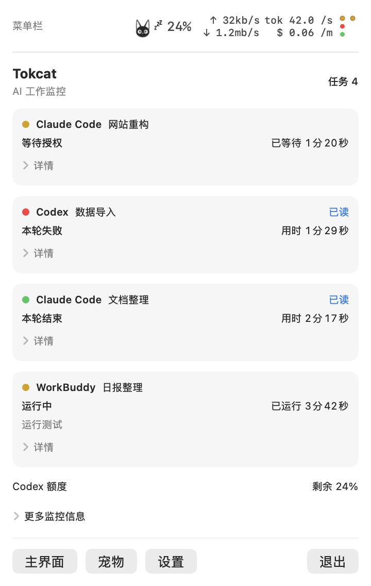
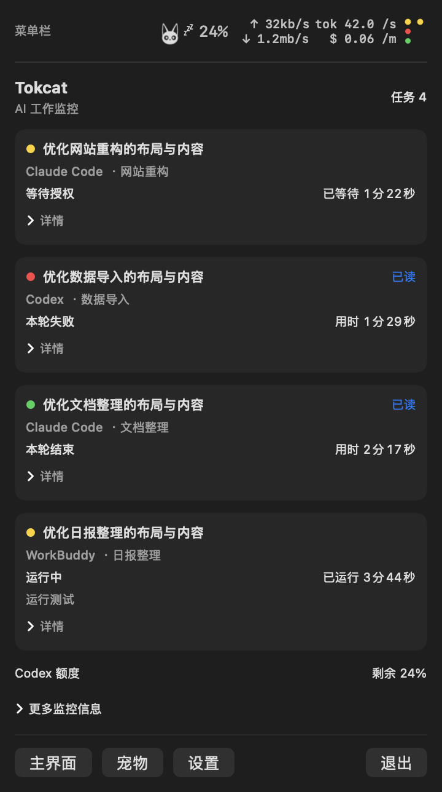
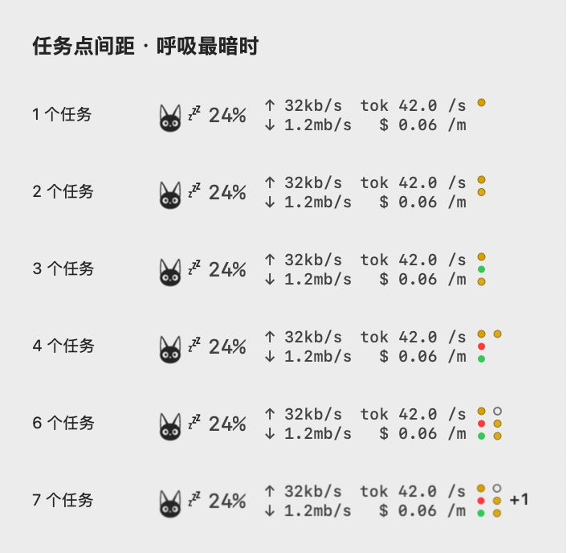
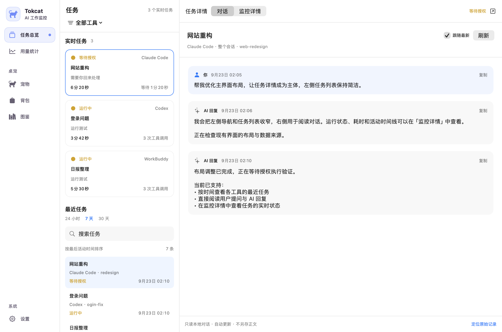
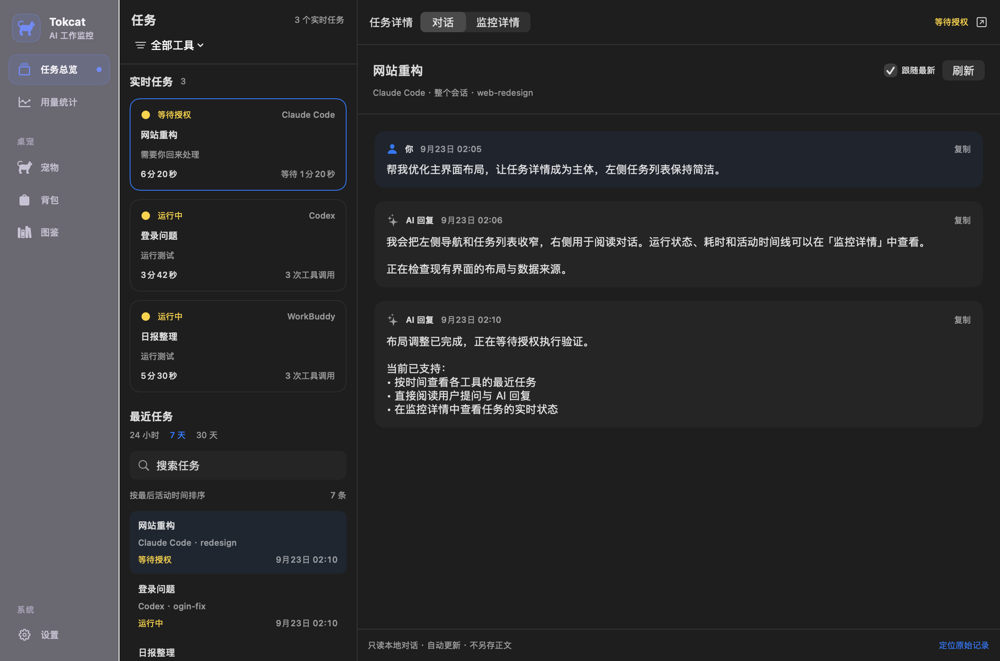
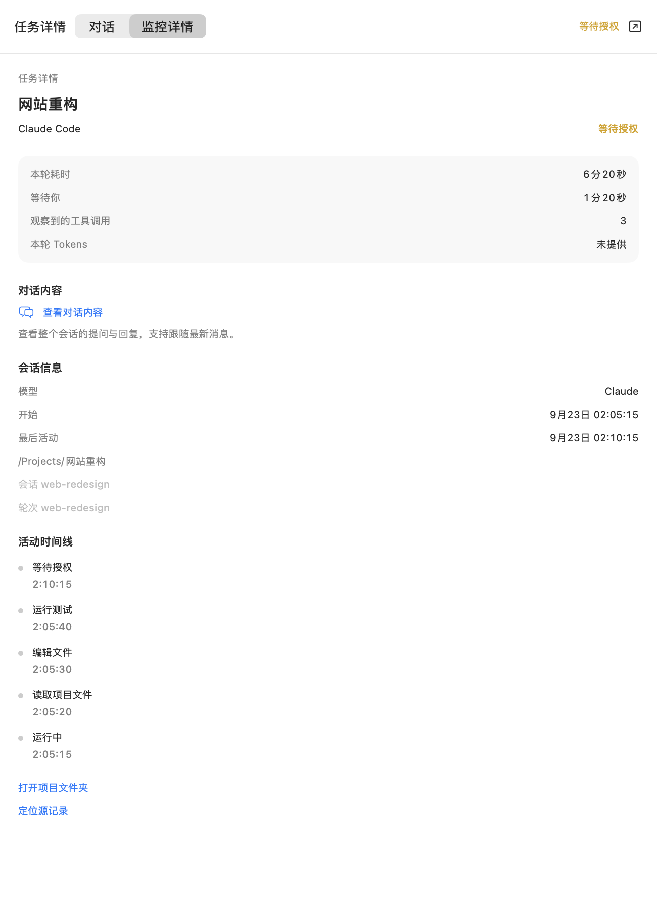
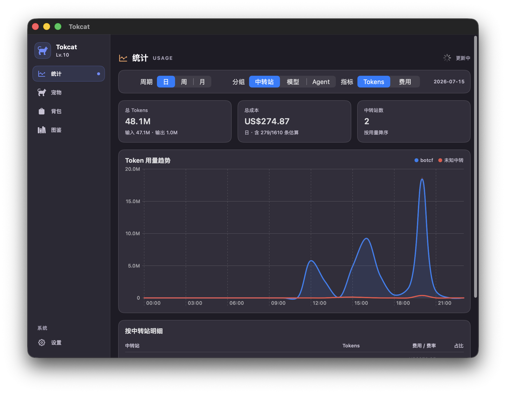

# Tokcat

**One macOS menu bar for all your AI agents. See what is running, what has finished, and what needs you.**

Tokcat brings **Codex, Claude Code, WorkBuddy, and other local AI tools** into one task monitor. Glance at colored task dots while you work, then open the main window to browse recent tasks, read conversations, and inspect timing and activity. Token usage, cost, system metrics, and an optional desktop cat complete the picture.

[English](README.md) | [中文](README.zh-CN.md)

[](LICENSE)
[](#requirements)
[](https://github.com/SelinLee/tokcat/releases)

## Menu bar: AI task status at a glance

<p align="center">
  
  
</p>

*Native light and dark previews with demonstration tasks. Select metrics and task dots independently in Settings → Menu Bar.*

Task dots appear **after the selected monitoring metrics**. Each column fills fixed top, middle, then bottom positions within the text's vertical bounds; two tasks use the top and middle slots. A fourth starts a new column on the right. Up to six are shown, followed by `+N` for more tasks.



*The dot examples show running, waiting, completed, failed, and unavailable states at the dimmest point of the running animation.*

| Dot | Meaning |
|---|---|
| 🟡 Pulsing yellow | Running; stays bright even at the dimmest point |
| 🟢 Green | Flashes for 3 seconds then disappears when its agent is foreground; stays solid in the background until viewed |
| 🟡🔴 Alternating yellow / red | Waiting for input or approval; switches color every 0.8 seconds, or stays red when Reduce Motion is enabled |
| 🔴 Solid red | Failed |
| ◯ Hollow gray | Updates unavailable or turn interrupted; silence alone does not mean completion |

The dropdown shows each conversation title first, followed by its agent, project, state, elapsed time, and recent activity. Codex titles come from its local session index; WorkBuddy uses its local database title. When no title is available, the project name is shown. While a recognized Codex, WorkBuddy / WorkBuddy AI, or Claude desktop app is foreground, each newly observed completion flashes green for 3 seconds before disappearing, without switching apps. Background completions stay visible until that agent is opened. Leaving during the countdown preserves the reminder and starts a fresh countdown on return. Generic terminals cannot identify the agent inside, so manual acknowledgement remains available. Read state survives restarts.

Task dots and CPU / GPU / memory / network / token / cost metrics are independently configurable. The dots follow the selected metrics, so both can remain visible. Optional native notifications surface completion and waiting states; historical notifications are not replayed at startup. The optional Codex quota display adds 5-hour and weekly remaining percentages and reset times when local login information is available.

## Keep track of AI work without switching windows

| What you want to know | What Tokcat shows |
|---|---|
| Which agents are still working? | One menu-bar dot per active or unread task, beside your existing metrics |
| Has a reply finished? | A green reminder until you acknowledge it or return to the corresponding desktop agent |
| Is an agent waiting for me? | Input / approval state and accumulated waiting time, when reported by the source |
| What did I work on recently? | A shared task list across tools, sorted by last activity, with source, time, and keyword filters |
| What did the agent say? | A large conversation pane with user messages and AI replies, copying, refresh, and follow-latest |
| What happened during a task? | Elapsed time, observed tool calls, available token counts, model, and activity timeline |
| How much am I spending? | Live token / cost rates and daily, weekly, monthly usage grouped by agent, model, or provider |

## Main window: tasks on the left, details in focus

The main window opens **Task Overview**. Narrow navigation and task columns leave most of the space for the selected task.



- **Live tasks:** current state, project, elapsed and waiting time, and latest activity.
- **Recent tasks:** one chronological list across tools; filter by agent, 24 hours / 7 days / 30 days, or keyword. Codex turns are archived separately.
- **Conversation:** local user messages and AI replies from Codex, Claude Code, and WorkBuddy. Select and copy text, follow new messages, or open a separate reading window.
- **Monitor:** elapsed and waiting time, observed tool calls, model, available per-turn tokens, and an activity timeline. Open the project folder, locate source records, or return to a valid Codex session.



### Task monitor

<p align="center">
  
</p>


*All task screenshots use demonstration data, not private conversations.*

## Agent support

Task state, task history, conversations, and usage are separate capabilities. Tokcat shows only what each local source provides.

| Source | Task state | Recent tasks | Conversation | Token / cost usage |
|---|---|---|---|---|
| **Codex** | Local lifecycle events | Yes, per turn | Yes | Yes |
| **Claude Code** | Opt-in local hooks | Yes | Yes | Yes |
| **WorkBuddy** | Explicit local database status | Yes, per session | Yes | Yes |
| **DeepSeek Harness** | Activity records only | Yes | — | Yes |
| **OpenClaw** | Activity records only | Yes | — | Yes |
| **Kimi** | Activity records only | Yes | — | Yes |
| **Cursor / Gemini CLI** | — | — | — | When local data is available |
| **CC Switch** | — | — | — | Provider attribution, reported cost, multiplier |

Codex reads local rollout events. Enable Claude Code lifecycle monitoring in **Settings → Agent**, then restart Claude Code sessions. Installation backs up and merges local hook settings; moving Tokcat requires re-enabling the hooks. WorkBuddy reads `~/.workbuddy/workbuddy.db` in read-only mode and links local conversation logs; an explicitly working session stays running while the database remains readable.

A quiet log is **not proof of completion**. An ended turn is not proof that a project is complete or tests passed. WorkBuddy does not infer per-turn start times. Activity-only records do not claim live execution state, and missing metrics remain unavailable. No estimated progress percentage is displayed without explicit step data.

## Usage and costs



- Live token and spend rates, today's totals, and cumulative spend.
- Day / week / month charts grouped by **agent, model, or provider / relay**.
- Editable local rates, with reported real prices when available through CC Switch.
- Optional CPU, GPU, memory, network, and thermal monitoring alongside AI task status.

## Start in 60 seconds

1. Install and open Tokcat; it appears in the menu bar.
2. Use Codex or WorkBuddy as usual. For Claude Code task states, enable local hooks in **Settings → Agent**.
3. Watch task dots beside your chosen metrics; click for quick status details.
4. Open **Task Overview** to read conversations and inspect live or recent tasks. Use **Stats** for token and cost trends.

## Local data and privacy

Task monitoring reads local logs, explicit lifecycle events, and local state databases. No account or cloud sync is required, and usage and conversations are not uploaded. **The optional Codex quota readout** contacts the ChatGPT usage endpoint using a local Codex login; it can be disabled in settings.

- Task metadata and read state: `~/Library/Application Support/TokenCat/agent-sessions.json` and `agent-task-history.json`.
- Task archive: up to **30 days / 500 records**. Initial import scans logs modified in the last seven days with bounded reads, so older turns may be absent.
- Conversations: loaded on demand from the linked session, bounded to the last **4 MB / 200 messages**, with truncation notices. Text stays in view memory and is not copied to the archive. Attachments use placeholders; system messages, tool internals, and reasoning records are excluded.
- Claude hooks store sanitized lifecycle metadata, not conversation text or tool arguments, in the local `session-inbox/` directory.
- Usage statistics: local `tokencat.sqlite3`. Usage adapters start at the end of existing files rather than backfilling entire histories.

## Optional desktop companion

<p align="center">
  
</p>

The desktop cat reacts to activity and grows with usage, with optional gear, inventory, and a collection book. Monitoring and statistics work fully with the pet disabled. Sound is off by default.

---

## Requirements

- macOS 13 Ventura or later  
- Dev build: Xcode 15+ / Swift 5.10+  

---

## Install

Download from [GitHub Releases](https://github.com/SelinLee/tokcat/releases):

### Recommended: DMG
1. Open `Tokcat-*-macos.dmg`  
2. Drag `Tokcat.app` into **Applications**  
3. **First launch**: right-click → **Open** (ad-hoc signed; one-time Gatekeeper bypass)  

### Alternative: Zip
1. Download `Tokcat-*-macos.zip` and unzip → `Tokcat.app`  
2. Drag into **Applications**  
3. Same first-launch step: right-click → **Open**  

Build a release locally:

```bash
TOKCAT_VERSION=0.5.0 scripts/package_app.sh
# Artifacts under dist/ (not committed):
#   Tokcat.app
#   Tokcat-0.5.0-macos.zip
#   Tokcat-0.5.0-macos.dmg
#   Tokcat-0.5.0-macos.sha256
#   INSTALL.txt
```

---

## Run from source

```bash
git clone https://github.com/SelinLee/tokcat.git
cd tokcat
swift build
swift test
swift run TokcatApp
```

---

## Architecture

```text
Claude Code / Codex / Cursor / Gemini / OpenClaw / WorkBuddy / Kimi / CC Switch
        │  local logs (read-only)
        ▼
  ├─ AgentSessionMonitor → task state / history / conversations
  └─ Adapters → TokenEvent (tokens, cost, model, provider)
        │
        ├─ Throughput / daily totals / menu-bar live UI
        ├─ UsageStats (day·week·month · Agent/Model/Provider)
        ├─ SQLite persistence
        └─ PetEngine / Loot (optional)
```

| Path | Role |
|------|------|
| `Sources/TokcatKit/Monitor/` | Agent lifecycle, task history, conversation readers, optional quota |
| `Sources/TokcatKit/Adapters/` | Per-agent log parsing & provider attribution |
| `Sources/TokcatKit/Economy/` | Pricing, nutrition tiers, **UsageStats** |
| `Sources/TokcatKit/Monitor/CodexUsageMonitor.swift` | Optional Codex 5h/weekly quota fetch (local `auth.json` → ChatGPT usage endpoint) |
| `Sources/TokcatKit/Persistence/` | Local SQLite |
| `App/` | Menu bar, main window, floating pet |
| `App/PixelPet/` | Pixel animation |
| `docs/assets/screenshots/` | Product screenshots used in this README |
| `docs/` | Pixel / pet design notes (secondary) |

---

## Roadmap (summary)

- [x] Multi-agent task monitor, menu-bar dots, conversation details, WorkBuddy state
- [x] Multi-agent local log adapters + live tok/s / cost  
- [x] Day / week / month stats (Agent / Model / Provider)  
- [x] Menu-bar metrics & main window  
- [x] Pixel pet / loot / bag / codex  
- [x] DMG + Zip release packaging  
- [ ] More agents / log formats  
- [ ] Developer ID signing & notarization  

---

## Contributing

Issues and PRs welcome. Please **do not** commit:

- `dist/`, `.build/`, local `*.sqlite` / personal logs  
- API keys, account paths, private usage exports  

---

## License

[MIT](LICENSE)

Third-party model assets: see corresponding `ATTRIBUTION.md` / model READMEs.
