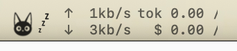
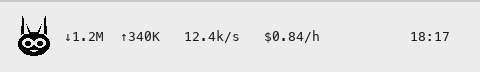
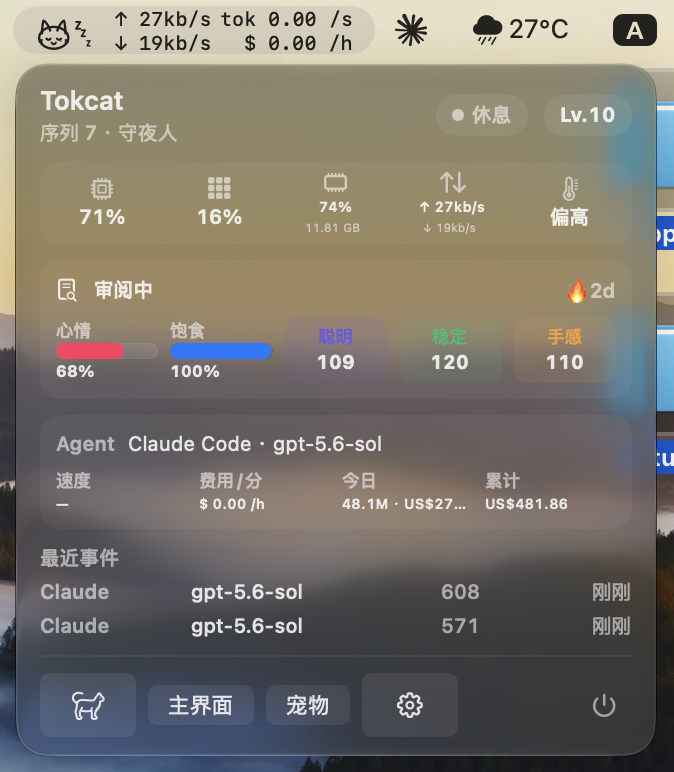
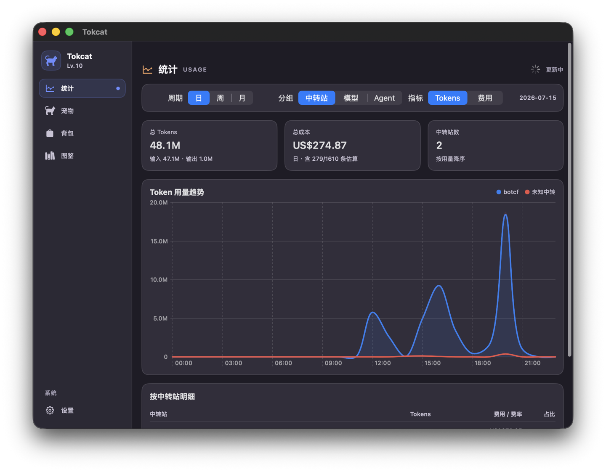
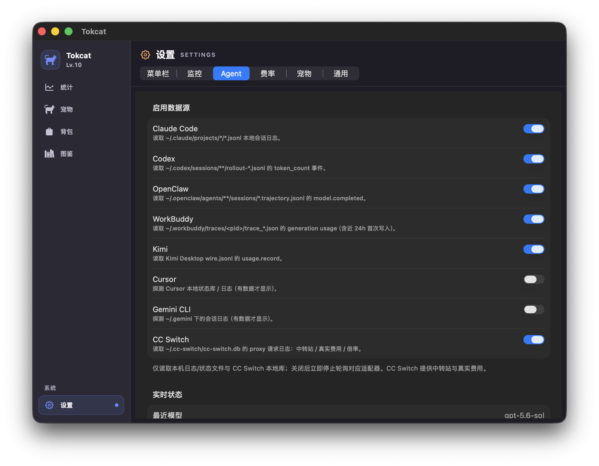
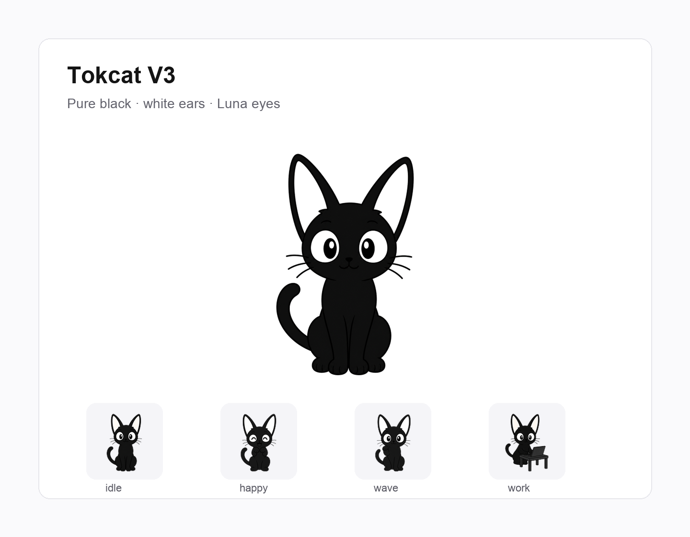
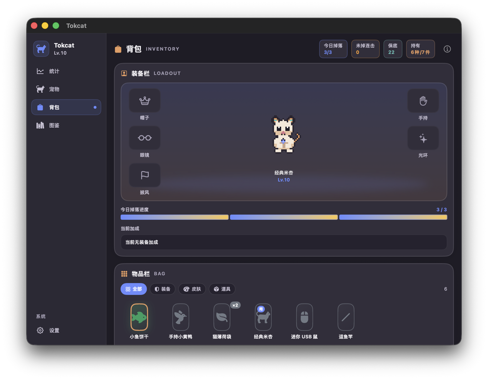
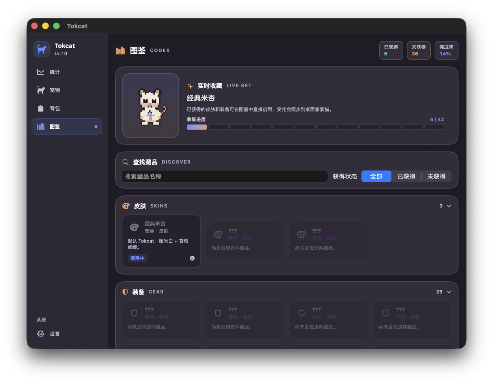

# Tokcat

<p align="center">
  
</p>

<p align="center"><sub>Tokcat V3 — 空闲 · 工作 · 饥饿 · 开心 · 招手 · 休息</sub></p>

**在 macOS 菜单栏实时监控多种 AI coding agent 的 token 用量与费用，并提供本地统计。**  
可选桌面像素宠物由同一批用量喂养。默认离线：不联网、不上传。

[English](README.md) | [中文](README.zh-CN.md)

[](LICENSE)
[](#环境要求)
[](https://github.com/SelinLee/tokcat/releases)

<p align="center">
  
</p>

<p align="center"><sub>菜单栏实时条：猫头图标 + 状态浮动（zzz · 蒸汽灯泡 · ✓）、网速 · Token 速率 · 费用速率。</sub></p>

---

## 为什么需要 Tokcat

同时用 Claude Code、Codex、Cursor 时，费用散落在各个工具里。  
Tokcat **只读本机 agent 日志**（无需 cloud hook、无需 API Key 上报），统一成 token 事件后给你：

| 你关心的 | 你能看到的 |
|----------|------------|
| **实时速率** | 菜单栏：`tok/s`、`$/h`，可选 CPU / GPU / 内存 / 网速 |
| **今日与累计** | 今日 tokens / 费用、累计费用 |
| **谁花的** | Agent · 模型 · 可选 **中转站 / provider**（CC Switch） |
| **趋势** | 日 / 周 / 月曲线；按中转站、模型、Agent 分组 |
| **本地费率** | 可编辑单价表 + 有上报时用真实费用 |
| **可选宠物** | Tokcat V3 随用量成长：掉落、背包、图鉴 |

> 宠物是可选壳层：**token 进来 → 统计落库 →（可选）喂养桌面猫**。  
> **即使不用宠物，监控与统计也能单独使用。**

---

## 界面一览

### 菜单栏实时与下拉面板

| 菜单栏 | 点击详情 |
|--------|----------|
|  |  |

- 猫头图标随状态变化（空闲 / 工作 / 休息 / 审阅…）
- 旁路指标：网速、**Token 速率**、**费用速率**
- 面板：系统条、宠物状态、当前 Agent + 模型、今日 / 累计费用、最近事件
- 快捷入口：主界面 · 宠物 · 设置 · 退出

### Token 用量统计



- 周期：**日 / 周 / 月**
- 分组：**中转站** · **模型** · **Agent**
- 指标：**Tokens** 或 **费用**
- 汇总卡片（总量、输入/输出、估算占比）+ 趋势曲线 + 明细表

### 支持的 Agent 列表



在 **设置 → Agent** 中开关各数据源。仅轮询**本机**日志 / 状态文件。

| 来源 | 读取内容 |
|------|----------|
| **Claude Code** | `~/.claude/projects/**/*.jsonl` 本地会话日志 |
| **Codex CLI** | `~/.codex/sessions/**/rollout-*.json` 的 `token_count` 事件 |
| **OpenClaw** | trajectory 的 `model.completed` |
| **WorkBuddy** | 本地 generation usage traces |
| **Kimi** | Desktop `wire.jsonl` 的 usage 记录 |
| **Cursor** | 本地状态库 / 日志（有数据才显示） |
| **Gemini CLI** | `~/.gemini` 会话日志（有数据才显示） |
| **CC Switch** | 本机 proxy 库 → **中转站归因、真实费用、倍率** |

新适配器默认从文件**末尾**跟踪，避免首次启动灌入海量历史。

### 可选像素宠物

| 宠物状态 | 物品背包 | 掉落图鉴 |
|----------|----------|----------|
|  |  |  |

- **宠物**：等级、序列、连续天数、心情 / 饱食 / 三围、动作预览  
- **背包**：装备栏（帽子 / 眼镜 / 披风 / 手持 / 光环）+ 物品筛选  
- **图鉴**：皮肤与装备收集进度；已获得的可直接启用  

主界面导航：**统计 · 宠物 · 背包 · 图鉴 · 设置**。

---

## 60 秒上手

1. 安装并打开 Tokcat（菜单栏出现猫头）  
2. 正常使用 Claude Code / Codex / Cursor 等  
3. 菜单栏可看 **tok/s · 费用速率**；点开面板查看今日用量  
4. 主界面 → **统计**：日 / 周 / 月曲线与明细  

数据仅写入本机 SQLite：`~/Library/Application Support/TokenCat/tokencat.sqlite3`

---

## 功能一览

### 1. 实时监控（菜单栏）
- **两种图标风格**：代码绘制表情脸（带状态浮动）或 AI 生成猫头肖像（template 自适应深浅模式）
- 状态浮动图标：`zzz`（睡觉）· `💡+蒸汽`（工作中）· `✓`（完成）
- 可选旁路：CPU、GPU、内存、网速、温度压力、**Token 速率**、**费用速率**  
- 下拉：Agent + 模型、速度、今日 / 累计费用、最近事件、宠物状态  

### 2. 统计与费率（主界面）
- 日 / 周 / 月；分组 = 中转站 / 模型 / Agent；Tokens 或费用  
- 异步聚合 + 缓存，切换周期不阻塞主线程  
- **设置 → 费率**：维护模型单价；可与 CC Switch 上报价配合  

### 3. 桌面宠物（可选）
- 默认 **Tokcat V3**（插画风帧动画）  
  - **rest 状态**改为站立转圈踱步（不再趴窝）
  - 全部 90 帧精灵经 AI 精修外轮廓，去除白边残留
  - 长尖耳、大眼睛、干净剪影
- 也可用方块猫 / 自定义 USDZ  
- 用量驱动成长：等级、聪明 / 稳定 / 手感、掉落、背包与图鉴  
- 音效默认关闭  

### 4. 隐私
- **应用本身不做网络请求**  
- 只读本机日志与系统指标  
- 无账号、无云同步、无 usage 上传  

---

## 环境要求

- macOS 13 Ventura 或更高  
- 开发构建：Xcode 15+ / Swift 5.10+  

---

## 安装

从 [GitHub Releases](https://github.com/SelinLee/tokcat/releases) 下载安装包：

### 推荐：DMG
1. 打开 `Tokcat-*-macos.dmg`  
2. 将 `Tokcat.app` 拖到「应用程序」  
3. **首次启动**：右键 → **打开**（ad-hoc 签名，需绕过 Gatekeeper 一次）  

### 备选：Zip
1. 下载 `Tokcat-*-macos.zip` 并解压得到 `Tokcat.app`  
2. 拖到「应用程序」  
3. 同样：右键 → **打开**  

本地打包：

```bash
TOKCAT_VERSION=0.3.1 scripts/package_app.sh
# 产物在 dist/（不入库）：
#   Tokcat.app
#   Tokcat-0.3.1-macos.zip
#   Tokcat-0.3.1-macos.dmg
#   Tokcat-0.3.1-macos.sha256
#   INSTALL.txt
```

---

## 从源码运行

```bash
git clone https://github.com/SelinLee/tokcat.git
cd tokcat
swift build
swift test
swift run TokcatApp
```

---

## 架构

```text
Claude Code / Codex / Cursor / Gemini / OpenClaw / WorkBuddy / Kimi / CC Switch
        │  本机日志（只读）
        ▼
  Adapters → TokenEvent（token、费用、模型、provider）
        │
        ├─ Throughput / 今日累计 / 菜单栏实时
        ├─ UsageStats（日周月 · Agent/模型/中转站）
        ├─ SQLite 持久化
        └─ PetEngine / Loot（可选养成）
```

| 路径 | 职责 |
|------|------|
| `Sources/TokcatKit/Adapters/` | 各 Agent 日志解析与 provider 归因 |
| `Sources/TokcatKit/Economy/` | 定价、营养分层、**UsageStats 看板** |
| `Sources/TokcatKit/Persistence/` | 本地 SQLite |
| `App/` | 菜单栏、统计主窗、悬浮宠物 |
| `App/PixelPet/` | 像素动画 |
| `docs/assets/screenshots/` | 本 README 使用的产品截图 |
| `docs/` | 像素与养成设定（次要） |

---

## 路线图（摘要）

- [x] 多 Agent 本地日志适配 + 实时 tok/s / 费用  
- [x] 日周月统计看板（Agent / 模型 / 中转站）  
- [x] 菜单栏指标与主界面  
- [x] 像素宠物 / 掉落 / 背包 / 图鉴  
- [x] DMG + Zip 发布打包  
- [ ] 更多 agent / 日志格式  
- [ ] Developer ID 签名与公证  

---

## 贡献

欢迎 Issue / PR。请勿提交：

- `dist/`、`.build/`、本地 `*.sqlite` / 个人日志  
- API Key、账号路径、私人 usage 导出  

---

## 许可

[MIT](LICENSE)

第三方模型资源见对应 `ATTRIBUTION.md` / 模型 README。
