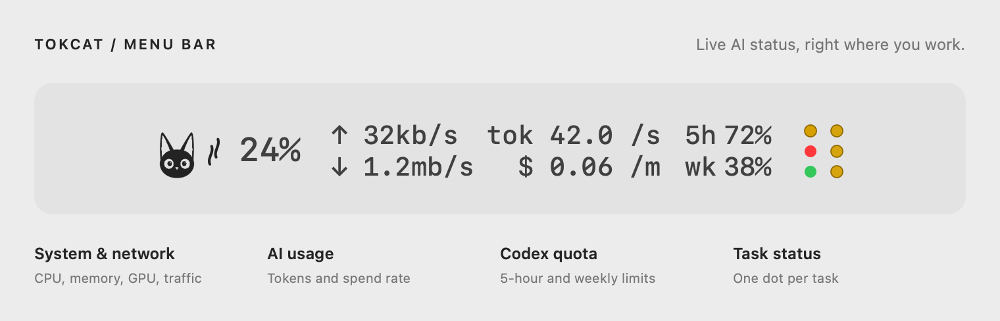
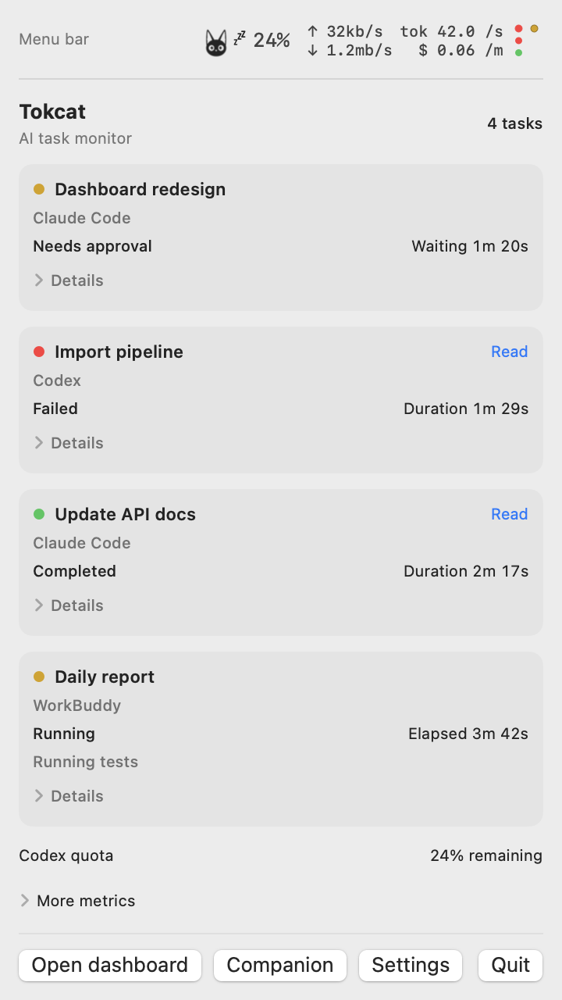
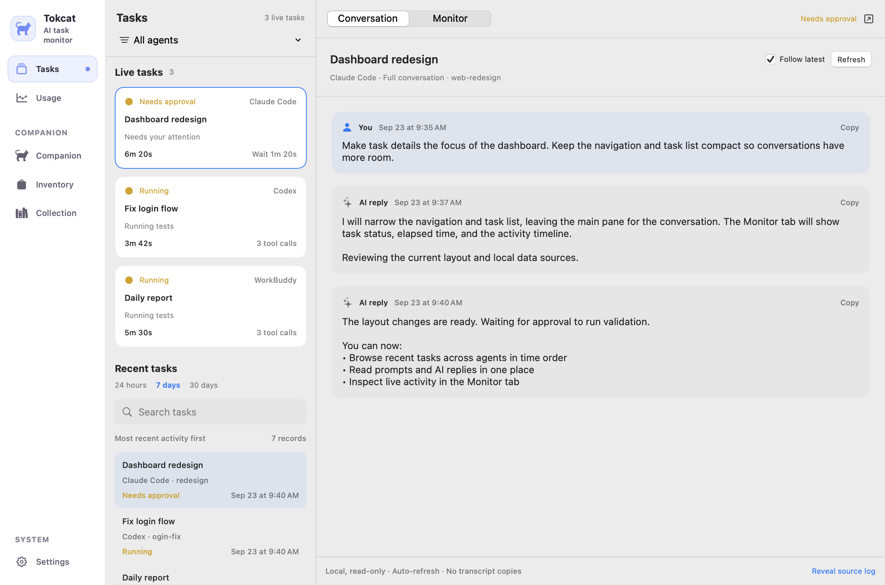
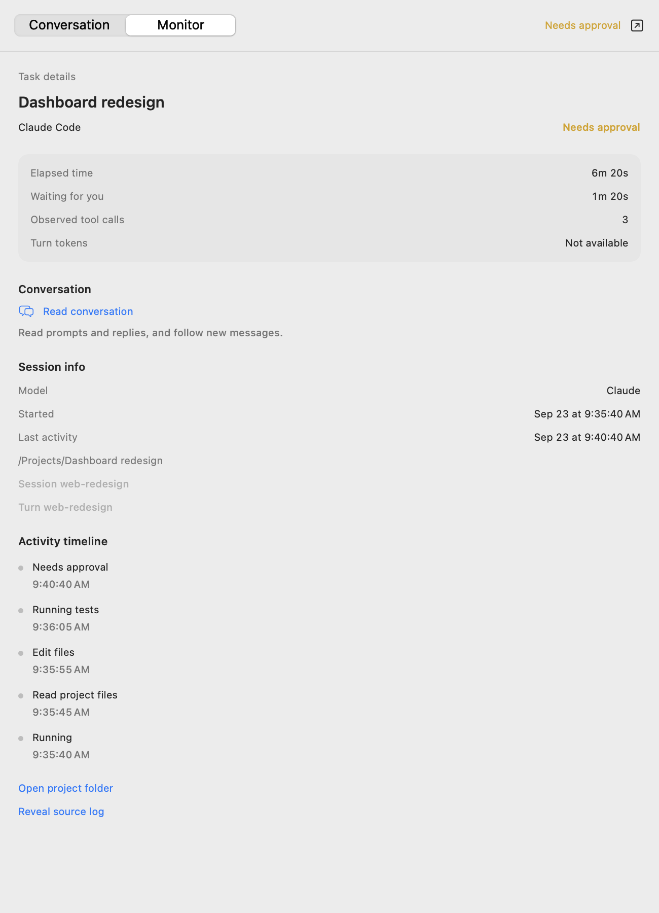

# Tokcat

**菜单栏里的多 Agent AI 任务监控工具。**

谁还在运行、谁已完成、谁需要你输入，一眼看清。Tokcat 将 **Codex、Claude Code、WorkBuddy** 汇总到同一套监控中：先看菜单栏，点开下拉面板了解情况，再进入主界面阅读对话、查看活动详情。

[English](README.md) | [中文](README.zh-CN.md)

[](LICENSE)
[](#环境要求)
[](https://github.com/SelinLee/tokcat/releases)

**[下载 Tokcat](https://github.com/SelinLee/tokcat/releases)** · [快速开始](#60-秒开始使用) · [Agent 接入能力](#agent-接入能力)

## 1. 顶部菜单栏：随时掌握 AI 状态

将 AI 任务状态放在日常监控指标旁边。**每个任务一个点**，排列在已选指标后方。

<p align="center">
  <picture>
    <source media="(prefers-color-scheme: dark)" srcset="docs/assets/screenshots/readme-menubar-dark.png" />
    
  </picture>
</p>

- **按需选择指标**：CPU、GPU、内存、网速、Token 吞吐与费用速率。
- **留意 Codex 额度**：可选显示 5 小时与周窗口的剩余额度，使用本机登录信息。
- **保持紧凑**：每列最多 3 个点，最多显示 6 个，其余显示 `+N`；状态点与监控指标可独立开关。

| 状态点 | 含义 |
|---|---|
| 🟡 黄色呼吸 | 任务正在运行。 |
| 🟡🔴 黄红交替 | 需要输入或批准，每 0.8 秒切换颜色。 |
| 🟢 绿色 | 本轮回复已结束。对应 Agent 在前台时闪烁 3 秒后自动消失；后台完成则保留到你查看。 |
| 🔴 红色常亮 | 本轮失败。 |
| ◯ 灰色空心 | 暂无更新或本轮已中断。 |

即使一直停留在同一个 Agent，完成绿点也会自动清除，无需切走再回来。3 秒计时期间离开，会保留提醒，等下次查看。开启系统**“减少动态效果”**时，等待点保持红色，完成点在计时期间保持绿色。

## 2. 下拉面板：点开就知道发生了什么

点击菜单栏，优先看到**对话标题**，再看对应 Agent、状态、耗时与最近活动。

<p align="center">
  <picture>
    <source media="(prefers-color-scheme: dark)" srcset="docs/assets/screenshots/readme-dropdown-dark.png" />
    
  </picture>
</p>

- 找到等待输入或批准的任务，查看已经等待多久。
- 展开任务详情，打开对话或项目，或将完成提醒标为已读。
- 查看最近完成的任务、Codex 额度，以及可选的用量和系统信息。
- 快速进入主界面或设置。内容变长、变短时，面板始终贴着菜单栏。

## 3. 主界面：左侧找任务，右侧看对话与监控

**任务列表保持简洁，详情成为主体。** 不同 Agent 的最近工作汇总到同一个列表，大部分界面空间留给当前选中的任务。

<p align="center">
  <picture>
    <source media="(prefers-color-scheme: dark)" srcset="docs/assets/screenshots/readme-tasks-dark.png" />
    
  </picture>
</p>

| 区域 | 能做什么 |
|---|---|
| **实时任务** | 查看当前状态、运行耗时、等待时间与最近活动。 |
| **最近任务** | 按最后活动时间排序；按 Agent、24 小时 / 7 天 / 30 天或关键词筛选，Codex 各轮次独立留存。 |
| **对话** | 阅读本地提问与 AI 回复，选择复制、跟随新消息，或打开独立阅读窗口。 |
| **监控详情** | 查看耗时、可观测的工具调用、模型、可用的本轮 Token，以及活动时间线。 |

<details>
<summary><strong>展开查看任务监控详情</strong></summary>

<p align="center">
  <picture>
    <source media="(prefers-color-scheme: dark)" srcset="docs/assets/screenshots/readme-monitor-dark.png" />
    
  </picture>
</p>

可从详情中打开原会话、定位本地日志，或跳转到项目文件夹。

</details>

**用量与费用**：实时 Token / 费用速率、今日用量，以及按 Agent、模型、中转站分组的日 / 周 / 月趋势。本地单价可编辑，CC Switch 可提供上报费用与中转站归因。

**可选桌面猫咪**：随工作状态变化，支持装备与图鉴。关闭桌宠仍可完整使用监控功能，声音默认关闭。

*图片使用原生界面与演示数据重新渲染，英文文字用于项目文档展示，不包含私人对话；浅色、深色图片随 GitHub 主题切换。*

## Agent 接入能力

任务状态、历史记录、对话阅读和用量统计是不同能力，界面只展示数据源实际提供的信息。

| 来源 | 任务状态 | 最近任务 | 对话阅读 | Token / 费用 |
|---|---|---|---|---|
| **Codex** | 本地生命周期事件 | 支持，按轮次 | 支持 | 支持 |
| **Claude Code** | 可选本地事件接入 | 支持 | 支持 | 支持 |
| **WorkBuddy** | 本地数据库明确状态 | 支持，按会话 | 支持 | 支持 |
| **DeepSeek Harness** | 仅活动记录 | 支持 | — | 支持 |
| **OpenClaw** | 仅活动记录 | 支持 | — | 支持 |
| **Kimi** | 仅活动记录 | 支持 | — | 支持 |
| **Cursor / Gemini CLI** | — | — | — | 本机有数据时显示 |
| **CC Switch** | — | — | — | 中转站归因、上报费用与倍率 |

Codex 自动读取本地 rollout 事件。Claude Code 需在**设置 → Agent**启用本地状态接入，再重启 Claude Code 会话；接入会备份、合并现有 hook 设置，移动 Tokcat 后需重新启用。WorkBuddy 只读 `~/.workbuddy/workbuddy.db` 并关联本地对话日志；只要数据库仍明确报告工作中，就不会仅因暂时没有新消息而变成空心点。

**日志安静不等于完成，本轮结束不等于项目完成或测试通过。** WorkBuddy 不推测每轮起点；仅有活动记录的来源不冒充实时任务状态。缺失的指标显示为未提供，没有明确步骤数据时不显示推测的进度百分比。

## 60 秒开始使用

1. [下载 Tokcat](https://github.com/SelinLee/tokcat/releases)，安装到 Applications 并打开。
2. 照常使用 Codex 或 WorkBuddy；Claude Code 需在**设置 → Agent**启用本地状态接入。
3. 在**设置 → 菜单栏**选择指标，观察状态点，点击查看详情。
4. 进入**任务总览**阅读对话、检查任务，或在**用量统计**查看 Token 与费用趋势。

## 本地数据与隐私

任务监控读取本机日志、明确的生命周期事件和本地状态数据库，不需要账号或云同步，不上传用量与对话。**可选的 Codex 额度显示**会使用本机 Codex 登录信息请求 ChatGPT 用量接口，可在设置中关闭。

- 任务元数据与已读状态保存在 `~/Library/Application Support/TokenCat/agent-sessions.json` 和 `agent-task-history.json`。
- 最多保留 **30 天 / 500 条**任务；首次扫描最近 7 天修改过的日志，读取量有限，不保证回填全部历史轮次。
- 对话按需读取整个关联会话，最多读取末尾 **4 MB / 最近 200 条消息**，截断时明确提示。正文只在视图内存中，不写入任务存档；附件显示占位，不展示系统消息、工具内部数据与推理记录。
- Claude hook 在本地 `session-inbox/` 写入经过筛选的生命周期信息，不保存对话正文或工具参数。
- 用量统计写入本机 `tokencat.sqlite3`；用量适配器从已有文件末尾开始跟踪，避免回填大量历史。

## 环境要求

- macOS 13 Ventura 或更高  
- 开发构建：Xcode 15+ / Swift 5.10+  

---

## 安装

从 [GitHub Releases](https://github.com/SelinLee/tokcat/releases) 下载安装包：

### 推荐：DMG
1. 打开 `Tokcat-*-macos.dmg`  
2. 将 `Tokcat.app` 拖到「应用程序」  
3. **首次启动**：右键 → **打开**（ad-hoc 签名，需绕过 Gatekeeper 一次）  

### 备选：Zip
1. 下载 `Tokcat-*-macos.zip` 并解压得到 `Tokcat.app`  
2. 拖到「应用程序」  
3. 同样：右键 → **打开**  

本地打包：

```bash
TOKCAT_VERSION=0.5.0 scripts/package_app.sh
# 产物在 dist/（不入库）：
#   Tokcat.app
#   Tokcat-0.5.0-macos.zip
#   Tokcat-0.5.0-macos.dmg
#   Tokcat-0.5.0-macos.sha256
#   INSTALL.txt
```

---

## 从源码运行

```bash
git clone https://github.com/SelinLee/tokcat.git
cd tokcat
swift build
swift test
swift run TokcatApp
```

---

## 架构

```text
Claude Code / Codex / Cursor / Gemini / OpenClaw / WorkBuddy / Kimi / CC Switch
        │  本机日志（只读）
        ▼
  ├─ AgentSessionMonitor → task state / history / conversations
  └─ Adapters → TokenEvent（token、费用、模型、provider）
        │
        ├─ Throughput / 今日累计 / 菜单栏实时
        ├─ UsageStats（日周月 · Agent/模型/中转站）
        ├─ SQLite 持久化
        └─ PetEngine / Loot（可选养成）
```

| 路径 | 职责 |
|------|------|
| `Sources/TokcatKit/Monitor/` | Agent 生命周期、任务历史、对话读取与可选额度 |
| `Sources/TokcatKit/Adapters/` | 各 Agent 日志解析与 provider 归因 |
| `Sources/TokcatKit/Economy/` | 定价、营养分层、**UsageStats 看板** |
| `Sources/TokcatKit/Persistence/` | 本地 SQLite |
| `App/` | 菜单栏、统计主窗、悬浮宠物 |
| `App/PixelPet/` | 像素动画 |
| `docs/assets/screenshots/` | 本 README 使用的产品截图 |
| `docs/` | 像素与养成设定（次要） |

---

## 路线图（摘要）

- [x] 多 Agent 任务监控、菜单栏状态点、对话详情与 WorkBuddy 状态接入
- [x] 多 Agent 本地日志适配 + 实时 tok/s / 费用  
- [x] 日周月统计看板（Agent / 模型 / 中转站）  
- [x] 菜单栏指标与主界面  
- [x] 像素宠物 / 掉落 / 背包 / 图鉴  
- [x] DMG + Zip 发布打包  
- [ ] 更多 agent / 日志格式  
- [ ] Developer ID 签名与公证  

---

## 贡献

欢迎 Issue / PR。请勿提交：

- `dist/`、`.build/`、本地 `*.sqlite` / 个人日志  
- API Key、账号路径、私人 usage 导出  

---

## 许可

[MIT](LICENSE)

第三方模型资源见对应 `ATTRIBUTION.md` / 模型 README。
