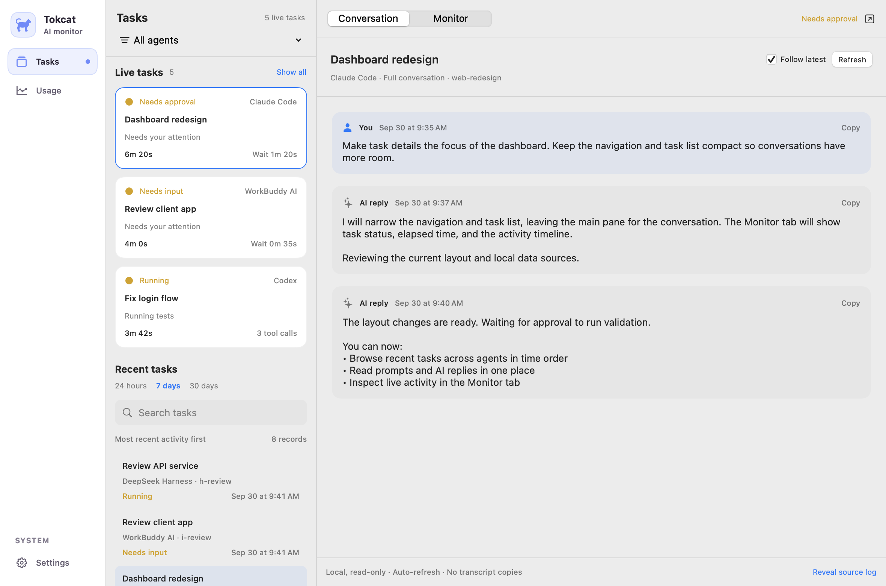
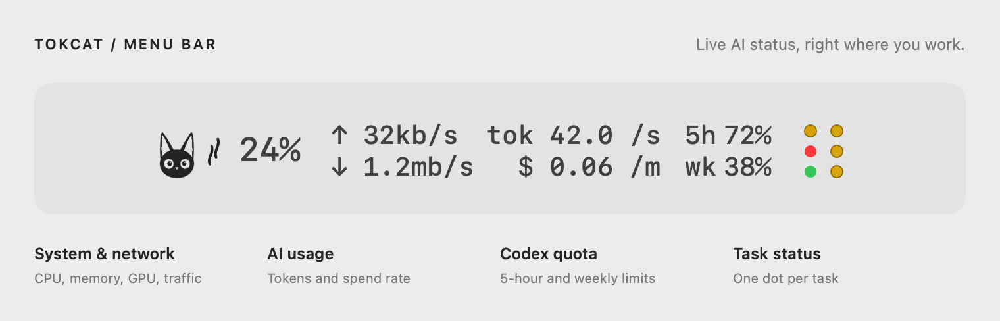
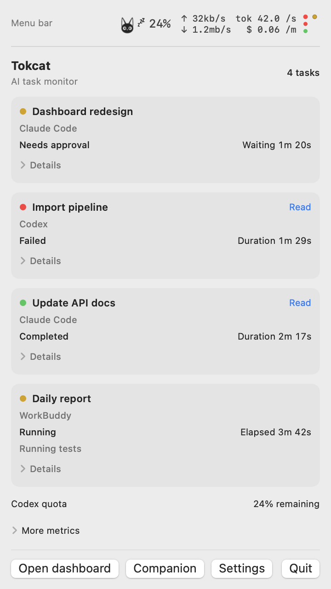
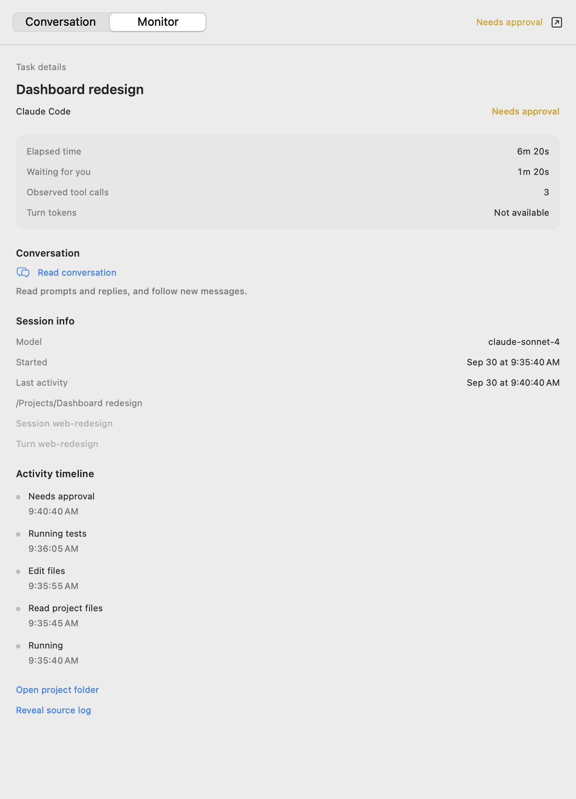
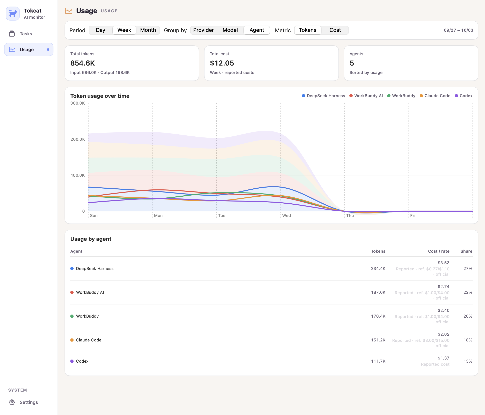
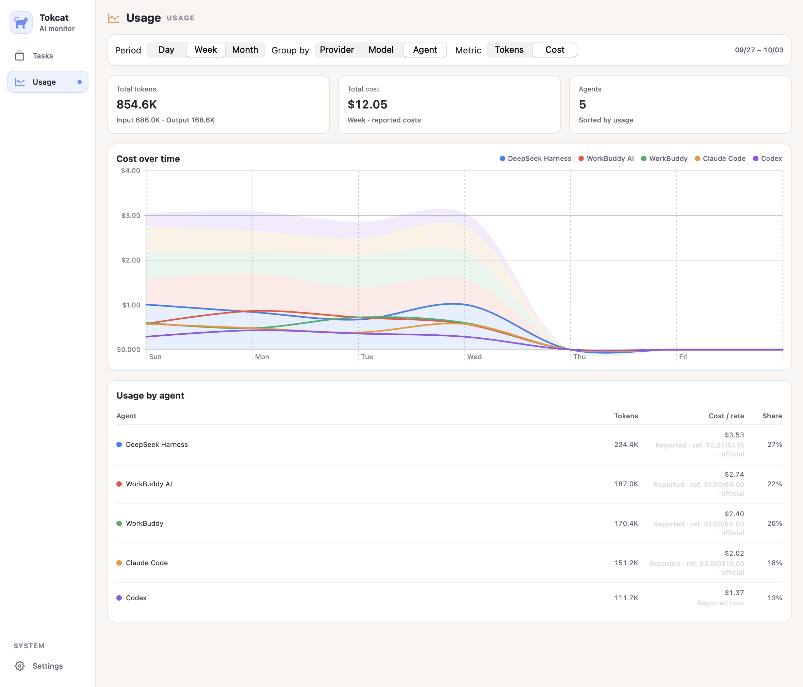
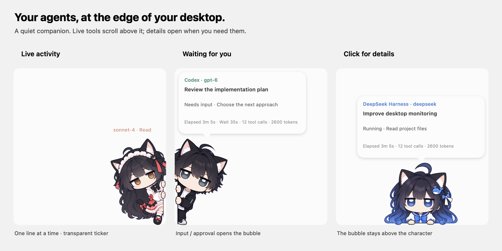
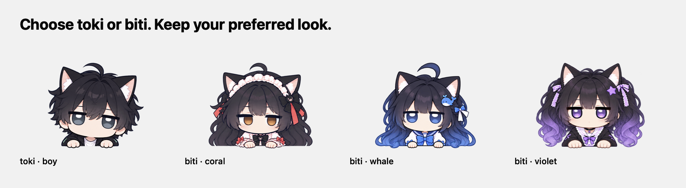
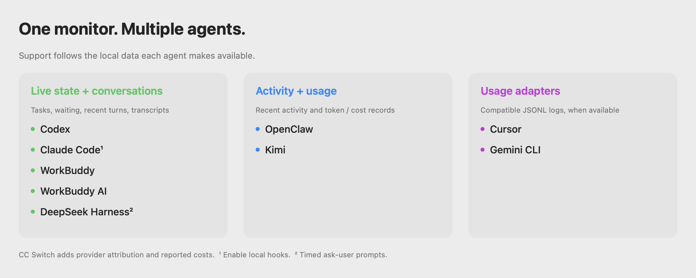

<div align="center">

# Tokcat

**多 Agent 同时开工，一眼看清谁在运行、谁在等你。**

原生 macOS 多 Agent 状态监控：实时任务、等待提醒、本地对话、用量趋势，以及安静贴在桌边的人形挂件。

[English](README.md) · [简体中文](README.zh-CN.md)

[](#安装) [](#从源码运行) [](LICENSE)

**[下载应用](https://github.com/SelinLee/tokcat/releases)** · [支持的 Agent](#支持的-agent) · [快速开始](#快速开始)

</div>

## 在一个窗口里跟进多个 Agent

谁正在运行，谁需要回答，谁已经完成本轮回复，统一放在任务列表中。选中任务后，窗口的大部分空间用于阅读对话。

<picture>
  <source media="(prefers-color-scheme: dark)" srcset="docs/assets/screenshots/readme-tasks-dark.png" />
  
</picture>

- **实时任务**：运行、等待回答、等待授权、本轮完成、失败与中断。
- **最近工作**：按 Agent、关键词和 24 小时／7 天／30 天筛选；Codex 按轮次保留任务记录。
- **本地对话**：阅读提问和回复，选择复制、跟随新消息，或打开独立阅读窗口。

## 看一眼菜单栏，就知道任务状态

每个任务对应一个状态点，排在你选择的监控指标后面。在其他应用中工作时，也能关注多个 Agent。

<picture>
  <source media="(prefers-color-scheme: dark)" srcset="docs/assets/screenshots/readme-menubar-dark.png" />
  
</picture>

| 状态点 | 含义 |
|---|---|
| 黄色呼吸 | 运行中 |
| 黄色／红色交替 | 需要你回答或授权 |
| 绿色 | 本轮完成；后台完成保留至查看 |
| 红色 | 失败 |
| 灰色空心 | 暂无更新或已中断，可打开详情查看 |

最多显示六个状态点，其余显示 `+N`。前台完成提示闪烁三秒后自动消失；系统开启「减少动态效果」时使用静态颜色。CPU、GPU、内存、网络、token 速度、费用速度和本地 Codex 额度均可选择显示。

## 点击后，查看具体上下文

下拉面板优先展示对话标题，再显示 Agent、当前状态、耗时与等待时间。可以展开任务、打开对话或项目、将完成标为已读，或进入主窗口。

<picture>
  <source media="(prefers-color-scheme: dark)" srcset="docs/assets/screenshots/readme-dropdown-dark.png" />
  
</picture>

## 查看每项任务的监控详情

在「监控详情」中查看耗时、等待时间、当前阶段、观察到的工具调用、模型、可获取的本轮 tokens，以及活动时间线。也可以直接打开原始对话、项目文件夹或本地记录。

<picture>
  <source media="(prefers-color-scheme: dark)" srcset="docs/assets/screenshots/readme-monitor-dark.png" />
  
</picture>

## 对比用量与费用

按日、周、月查看趋势，并按 **Agent、模型或中转站** 分组。展示输入／输出 tokens、费用、计费费率和各组占比；上报费用与费率估算分别标注，费率可以本地修改。

<picture>
  <source media="(prefers-color-scheme: dark)" srcset="docs/assets/screenshots/readme-usage-dark.png" />
  
</picture>

<details>
<summary>查看费用视图</summary>

<picture>
  <source media="(prefers-color-scheme: dark)" srcset="docs/assets/screenshots/readme-costs-dark.png" />
  
</picture>

CC Switch 可以补充中转站归属、上报费用和计费倍率。Codex 的五小时／每周剩余额度来自客户端写入的本地日志，仅在桌面客户端运行时显示。

</details>

## 安静贴在桌边的人形挂件

新桌宠始终吸附在屏幕边缘、右下角或 Dock 两侧。拖动只沿选定边缘微调位置。

<picture>
  <source media="(prefers-color-scheme: dark)" srcset="docs/assets/screenshots/readme-companion-dark.png" />
  
</picture>

- **平时保持安静**：没有常驻气泡。最近工具调用与阶段信息在人物上方逐行向上滚动，透明背景，宽度随人物。
- **需要时展开详情**：点击人物，或 Agent 等待回答／授权时，气泡在人物上方展开；点击气泡打开任务总览。
- **手动选择形象**：男生 **toki**，或 **biti** 的珊瑚、蓝鲸、紫星三套服装。统一使用平静、无笑容表情；动态文字的模型颜色独立于人物选择。

<picture>
  <source media="(prefers-color-scheme: dark)" srcset="docs/assets/screenshots/readme-avatars-dark.png" />
  
</picture>

在「设置 → 桌边挂件」或人物右键菜单选择形象和吸附位置。[桌宠行为说明](docs/DesktopCompanion.md)

## 支持的 Agent

<picture>
  <source media="(prefers-color-scheme: dark)" srcset="docs/assets/screenshots/readme-agents-dark.png" />
  
</picture>

| Agent | 实时任务状态 | 最近任务 | 对话阅读 | 用量／费用 |
|---|---|---|---|---|
| **Codex** | 本地生命周期事件 | 按轮次 | ✓ | ✓ |
| **Claude Code** | 启用本地 hooks 后可用 | ✓ | ✓ | ✓ |
| **WorkBuddy** | 本地数据库状态 | 按会话 | ✓ | ✓ |
| **WorkBuddy AI** | 本地数据库状态 | 按会话 | ✓ | ✓ |
| **DeepSeek Harness** | 本地会话投影状态 | 按会话 | ✓ | ✓ |
| **OpenClaw** | 仅活动记录 | 活动记录 | — | ✓ |
| **Kimi** | 仅活动记录 | 活动记录 | — | ✓ |
| **Cursor** | — | — | — | 兼容 JSONL 日志，可选 |
| **Gemini CLI** | — | — | — | 兼容 JSONL 日志，可选 |

**CC Switch** 是计费集成，补充中转站与上报费用，不提供任务生命周期状态。

Claude Code hooks 由你主动启用。DeepSeek Harness 同时覆盖 `dsh web` 与 DSH Desktop，等待提示需要 Harness 的 **timed ask-user** 模式。Cursor 与 Gemini CLI 默认关闭，需有兼容的本地用量记录。[接入方式与数据源](docs/AgentSupport.md)

状态以本地来源提供的信息为准。日志安静不等于完成，本轮结束不等于整个项目完成。缺少的指标保持不可用，不虚构进度百分比。

## 快速开始

1. 安装并打开 Tokcat，照常使用各个 Agent。
2. 如需 Claude Code 状态，在「设置 → Agent」启用 hooks，再重启已有 Claude Code 会话。
3. 选择菜单栏指标，通过状态点关注任务；打开「任务总览」阅读对话，或「用量统计」查看趋势。
4. 在「设置 → 桌边挂件」选择 toki／biti 和吸附位置。

## 安装

需要 **macOS 13+**。从 [Releases](https://github.com/SelinLee/tokcat/releases) 下载 DMG 或 ZIP，将 `Tokcat.app` 放进 Applications。首次打开时右键选择「打开」。当前采用 ad-hoc 签名，尚未进行 Developer ID 公证；发行文件的架构取决于构建机器。

监控仅读取本地记录，无需 API key。用量数据库位于 `~/Library/Application Support/Tokcat/`，任务缓存及可选 Claude hooks 位于 `~/Library/Application Support/TokenCat/`。桌宠与任务监控共用状态来源，升级保留用量历史和监控设置。

## 从源码运行

```sh
git clone https://github.com/SelinLee/tokcat.git
cd tokcat
swift build
swift test
swift run TokcatApp
```

使用 `TOKCAT_VERSION=0.7.0 scripts/package_app.sh` 打包发行文件，产物放在 `dist/`。

| 目录 | 用途 |
|---|---|
| `App/` | 菜单栏、任务与对话、用量统计和设置 |
| `App/Companion/` | 透明挂件窗口、气泡、滚动动态和吸附 |
| `Sources/TokcatKit/` | 本地适配器、任务生命周期与历史、定价、用量持久化 |
| `Tests/` | 监控、适配器、用量、设置与桌宠回归检查 |
| `scripts/docs_screenshots/` | 可重复生成的原生功能展示图 |

配图使用原生视图、示例数据及展示用英文文案，不含私人对话，也不代表应用已经完整英语本地化。浅色／深色配图跟随 GitHub 主题。[配图生成说明](scripts/docs_screenshots/README.md)

[MIT](LICENSE)。桌宠交互参考 [DeepSeek Balance Whale Widget](https://github.com/MeteorNOX/DeepSeek-Balance-Whale-Widget)，toki／biti 图集沿用项目的人物参考。
