<div align="center">

# tokcat

通过 macOS 菜单栏或 Windows 任务栏，查看 AI 助手的任务状态、对话和用量。按下快捷键即可搜索应用、计算或运行命令。

[English](README.md) · [简体中文](README.zh-CN.md)

**[安装 macOS 版](#安装-macos-版)** · **[直接下载 Windows ZIP](https://github.com/SelinLee/tokcat/releases/download/windows-2026.11.14/tokcat-windows-2026.11.14.zip)**

</div>

| | macOS 13 及以上 | Windows 10 / 11 预览版 |
|---|---|---|
| 查看任务 | 点击菜单栏状态点打开任务列表，也可把 toki 或 biti 挂件放在桌边 | 点击任务栏状态点打开详情窗口，或从通知区域进入 |
| 快捷启动 | **Control + 空格** 打开启动器，可搜索应用和运行终端命令 | **Alt + 空格** 打开启动器，可切换赛博轮盘，也可通过 Everything 搜索本机文件 |
| 获取方式 | [macOS 发布包](https://github.com/SelinLee/tokcat/releases/latest) | [Windows ZIP](https://github.com/SelinLee/tokcat/releases/download/windows-2026.11.14/tokcat-windows-2026.11.14.zip) · [Windows 安装说明](#安装-windows-版) |

## 快捷运行框

两个平台都支持用名称、拼音或首字母查找应用。试试输入 `sqrt(9)+2^3`，按回车复制结果 `11`，或输入 `example.com` 打开网站。

**macOS** · 下面的演示先展示菜单栏任务状态，再用赛博轮盘启动 Chrome。点击动图可下载高清视频。要在 Mac 上试用轮盘，可[从主分支源码运行](#从源码运行)。

<p>
  <a href="https://github.com/SelinLee/tokcat/raw/refs/heads/main/docs/assets/demos/launcher-chrome.mp4?v=2">
    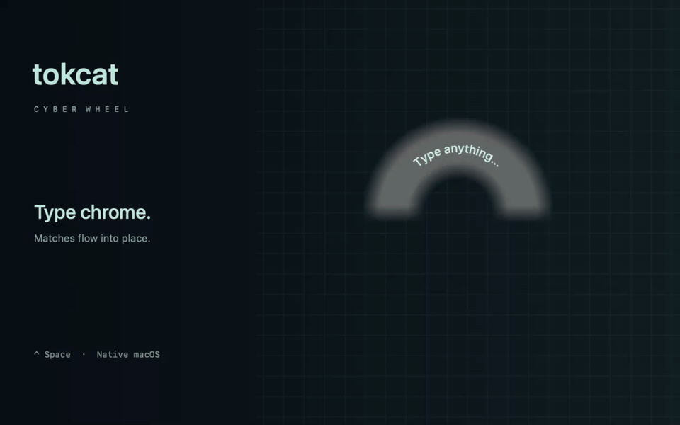
  </a>
</p>

**Windows** · 在「快速启动 → 通用」选择「赛博轮盘」并保存，再按 **Alt + 空格** 唤出。输入拼音时，轮盘会在选词前匹配应用。继续输入或退格，结果会在最多三层圆弧内连续重排。同一设置页也可选择「经典」和「赛博悬浮」。[Windows 快速启动指南](windows/README.zh-CN.md#快速启动框)

<picture>
  <source media="(prefers-color-scheme: dark)" srcset="windows/docs/ui-dark.png" />
  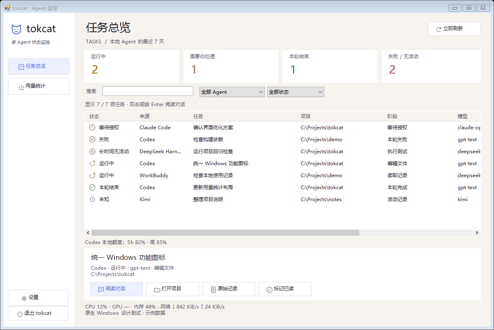
</picture>

<details>
<summary>macOS 启动器操作、示例与设置</summary>

按 **Control + 空格** 唤出一条圆角输入框，开始输入后才展开匹配或结果；回车提交后立即收起。也可以点击菜单栏的放大镜打开。

<picture>
  <source media="(prefers-color-scheme: dark)" srcset="docs/assets/screenshots/readme-launcher-input-dark.png" />
  
</picture>

| 输入示例 | 功能 | 按回车 |
|---|---|---|
| `Chrome` | 中英文名称、拼音、缩写匹配应用 | 打开选中的应用 |
| `sqrt(9)+2^3` | 实时显示结果 `11` | 复制结果 |
| `tran+hello` / `tran hello` | 单词优先显示系统词典释义；短句或未命中时列出网页翻译 | 复制释义或打开选中的翻译网站 |
| `> pwd` | 终端命令 | 打开终端并执行 |
| `baidu 人工智能` | 百度搜索；也支持 `google`、`bing` | 在默认浏览器搜索 |
| `example.com` | 识别域名或完整 HTTP(S) 网址 | 打开网站 |
| `setup` | 设置入口 | 打开 tokcat 设置 |
| `empty` | 预设清空废纸篓命令，关键词可修改 | 确认后清空 |
| `gg` | 预设退出其他应用命令，关键词可修改 | 默认确认后请求退出 |

- **历史直接填回输入框**：最多保存 50 条本机记录。空白时按 **↑** 调出历史，再用 **↑ / ↓** 切换；文字随即显示在输入框中，可以继续编辑或回车重用。
- **常用选项优先**：成功打开应用后累计使用次数，在名称匹配的基础上提高排序权重；精确名称始终优先，次数相同时最近使用优先。翻译方式保留设置的默认项置顶，其余方式按使用频次排序。频次独立保存在本机，重启后保留；「设置 → 通用 → 清空历史与频次」可重置。旧版没有保存使用次数，因此升级后开始累计。
- **窗口记住位置**：「经典」和「赛博悬浮」可拖动背景或左侧图标移动，重新唤出或重启后恢复；换屏后自动移回可见区域。
- **先列表，再详情**：「**设置 → 命令**」和「**设置 → 网站**」只列出名称、关键词和启用状态，点击条目才打开详细设置。新增或编辑后点“保存”生效，“取消”保留原配置。
- **快捷键可录入**：在「**设置 → 通用 → 应用启动器**」修改组合键或关闭全局快捷键；快捷键被占用时显示提示。
- **启动器皮肤可选**：在「**设置 → 通用 → 应用启动器**」选择「经典」「赛博悬浮」或「赛博轮盘」。两种赛博皮肤使用无外框、边缘渐隐的连续背景模糊。macOS 14 及以上可在这里启用自动字色，授予「屏幕与系统音频录制」权限后，文字随后方背景明暗变化；只在启动框打开时采样一小块区域，不保存画面。未授权时，字色跟随 macOS 外观。
- **赛博轮盘**：上方输入弧与最高权重结果的下方 **180°** 弧形合为内圈；后续选项按权重向外层展开，围绕完整圆周均衡排布，层级越外、权重越低，弧度越短。上半圈文字与图标保持正向可读。重排时保持规整圆弧；同一圆心、同一半径的相邻弧段沿圆周挤压、融合再分开，模糊沿同圈流动。图标和名称保留弹性移动，新选项浮入，旧选项收缩淡出；连续输入会从当前显示位置接续，系统「减少动态效果」可关闭动效。结果排名与累计使用频率决定优先级。默认跟随鼠标；方向键固定轮盘，**↑ ↓ ← →** 按屏幕上的实际方位选择，下方并列先选左侧，继续按 ↓ 优先进入更深层；没有更下方结果时再选右侧，边缘不反向跳转。也可悬停点击或回车。按住 **Command** 锁定鼠标，以色散光线指向选项，松开执行；点按 Command、指向圆心或输入弧、按 Esc、使用编辑快捷键均可取消。呼出和清空时只显示输入弧，输入内容后才出现网页搜索。
- **同心圆结果与翻译**：通用提示「输入内容…」服务应用、算式、命令、网址和翻译。检测到单词时提供「翻译」选项，同时保留应用匹配；选中后才查询并展开释义。更改输入会收回释义，重新提供当前单词的翻译选项。释义在轮盘旁展开，按住 **Command** 并双指上下滚动即可阅读，松键结束阅读，不执行圆弧选项。结果中保留「复制释义」「网页翻译」和输入后的「网页搜索」。释义覆盖范围及语言跟随 macOS 启用的词典。
- **翻译方式可配置**：在「**设置 → 翻译**」添加、编辑、删除或启用翻译地址，并选择默认方式（初始为 Google 翻译，另有 Bing）。地址中的 `{query}` 会替换为编码后的完整内容；预设译为中文，可编辑地址更改目标语言。用 **↑ / ↓** 选择后回车打开网页。系统释义可滚动查看，也可点击“网页翻译”；词库和释义语言跟随 macOS「词典」App 的设置。
- **无匹配时搜索**：在「**设置 → 网站**」选择备用搜索引擎；没有匹配应用时，按回车即可在默认浏览器搜索输入内容。

<details>
<summary>查看计算器、网站搜索和设置界面</summary>

**实时计算**支持括号、四则运算、`^` / `**` 幂运算、后缀百分号（`200*10%`）、科学计数法及 `pi` / `π`、`e` 常量。常用函数包括 `sqrt`、`abs`、`pow`、`min`、`max`、`round`、`floor`、`ceil`、`exp`、`ln`、`log` / `log10`、`log2`、`sin` / `cos` / `tan`（弧度）。也可用 `=` 开头明确进入计算模式；算式未完成、除零或参数不适用时会显示提示。

<picture>
  <source media="(prefers-color-scheme: dark)" srcset="docs/assets/screenshots/readme-launcher-calculator-dark.png" />
  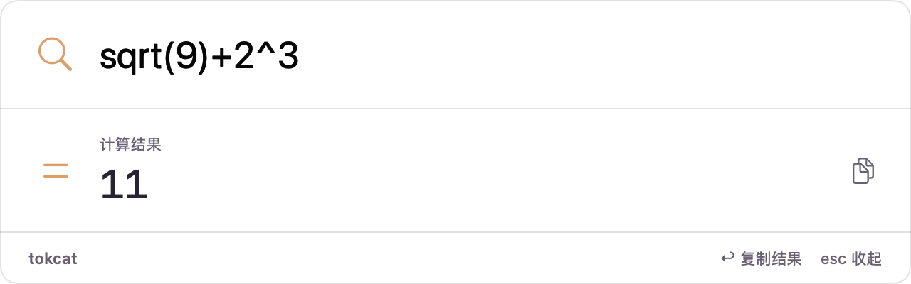
</picture>

**网站关键词**既可直达网站，也可搜索。搜索地址用 `{query}` 表示内容，例如 `https://www.baidu.com/s?wd={query}`；搜索词会作为文本编码。预设 `github` 可直接打开 GitHub。

<picture>
  <source media="(prefers-color-scheme: dark)" srcset="docs/assets/screenshots/readme-launcher-search-dark.png" />
  
</picture>

**自定义命令**支持终端命令、清空废纸篓和退出其他应用。清空废纸篓前会再次确认；退出应用时保留 tokcat 和访达，由各应用提示保存未完成内容。首次操作终端或访达时，macOS 可能询问自动化权限。

<picture>
  <source media="(prefers-color-scheme: dark)" srcset="docs/assets/screenshots/readme-launcher-websites-dark.png" />
  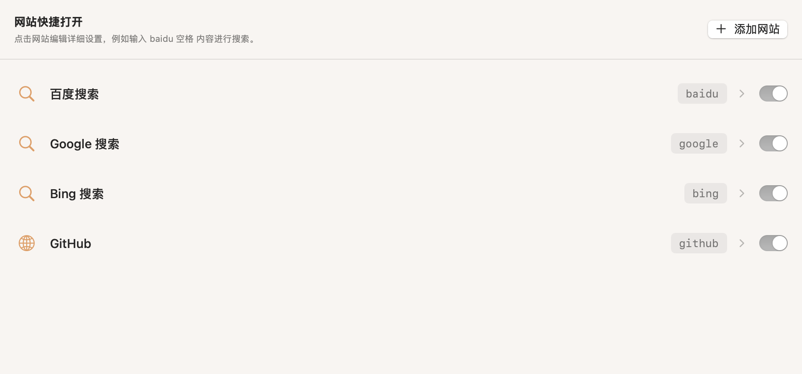
</picture>

</details>

</details>

## macOS 界面导览

<details>
<summary>查看菜单栏、桌边挂件、任务与用量截图</summary>

### 安静贴在桌边的人形挂件

<picture>
  <source media="(prefers-color-scheme: dark)" srcset="docs/assets/screenshots/readme-avatars-dark.png" />
  
</picture>

新桌宠始终吸附在屏幕边缘、右下角或 Dock 两侧。拖动只沿选定边缘微调位置。

<picture>
  <source media="(prefers-color-scheme: dark)" srcset="docs/assets/screenshots/readme-companion-dark.png" />
  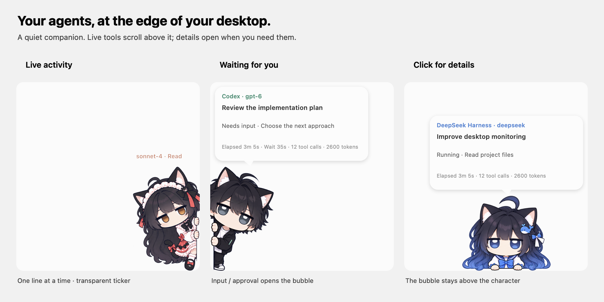
</picture>

- **平时保持安静**：没有常驻气泡。最近工具调用与阶段信息在人物上方逐行向上滚动，透明背景，宽度随人物。
- **需要时展开详情**：点击人物，或 Agent 等待回答／授权时，气泡在人物上方展开；点击气泡打开任务总览。
- **手动选择形象**：男生 **toki**，或 **biti** 的珊瑚、蓝鲸、紫星三套服装。统一使用平静、无笑容表情；动态文字的模型颜色独立于人物选择。

在「设置 → 桌边挂件」或人物右键菜单选择形象和吸附位置。在该设置页的「头顶信息」可切换为常驻模式：任务名称最多两行，超出部分以省略号结尾，tok/s 在下方单独一行；多个任务纵向排列。[桌宠行为说明](docs/DesktopCompanion.md)

### 在一个窗口里跟进多个 Agent

谁正在运行，谁需要回答，谁已经完成本轮回复，统一放在任务列表中。选中任务后，窗口的大部分空间用于阅读对话。

<picture>
  <source media="(prefers-color-scheme: dark)" srcset="docs/assets/screenshots/readme-tasks-dark.png" />
  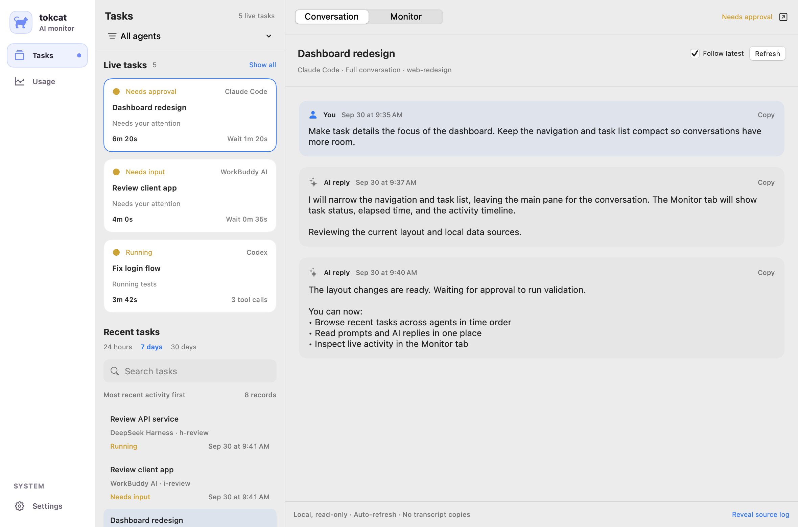
</picture>

- **实时任务**：运行、等待回答、等待授权、本轮完成、失败与中断。
- **最近工作**：按 Agent、关键词和 24 小时／7 天／30 天筛选；Codex 按轮次保留任务记录。
- **本地对话**：阅读提问和回复，选择复制、跟随新消息，或打开独立阅读窗口。

### 看一眼菜单栏，就知道任务状态

每个任务对应一个状态点，排在你选择的监控指标后面。在其他应用中工作时，也能关注多个 Agent。

<picture>
  <source media="(prefers-color-scheme: dark)" srcset="docs/assets/screenshots/readme-menubar-dark.png" />
  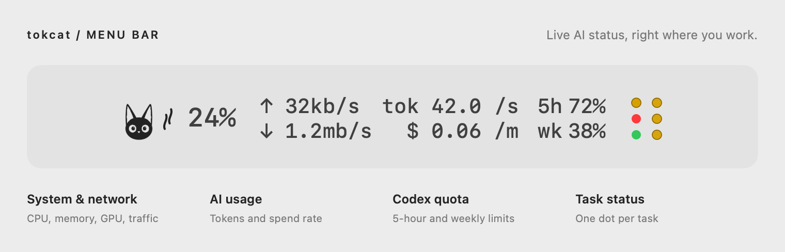
</picture>

| 状态点 | 含义 |
|---|---|
| 黄色呼吸 | 运行中 |
| 黄色／红色交替 | 需要你回答或授权 |
| 绿色 | 本轮完成；后台完成保留至查看 |
| 红色实心 | 失败 |
| 红色空心 | 运行中的任务超过 2 分钟无新活动；保持显示，新活动到达后恢复 |
| 灰色空心 | 状态未知或已中断，可打开详情查看 |

最多显示六个状态点，其余显示 `+N`。前台完成提示闪烁三秒后自动消失；系统开启「减少动态效果」时使用静态颜色。CPU、GPU、内存、网络、token 速度、费用速度和本地 Codex 额度均可选择显示。

### 点击后，查看具体上下文

下拉面板优先展示对话标题，再显示 Agent、当前状态、耗时与等待时间。运行时间下方显示该会话最近 60 秒的输出 tok/s 估算（包含推理输出，不含输入和缓存；数据不足显示 `—`）。30 秒无新活动时显示持续时长，2 分钟后显示红色「长时间无活动」提示；这不等于任务失败，执行长工具或等待网络也可能触发。可以展开任务、打开对话或项目、将完成标为已读，或进入主窗口。

<picture>
  <source media="(prefers-color-scheme: dark)" srcset="docs/assets/screenshots/readme-dropdown-dark.png" />
  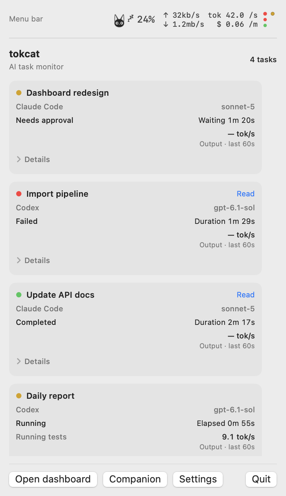
</picture>

### 查看每项任务的监控详情

在「监控详情」中查看耗时、等待时间、当前阶段、观察到的工具调用、模型、可获取的本轮 tokens，以及活动时间线。也可以直接打开原始对话、项目文件夹或本地记录。

<picture>
  <source media="(prefers-color-scheme: dark)" srcset="docs/assets/screenshots/readme-monitor-dark.png" />
  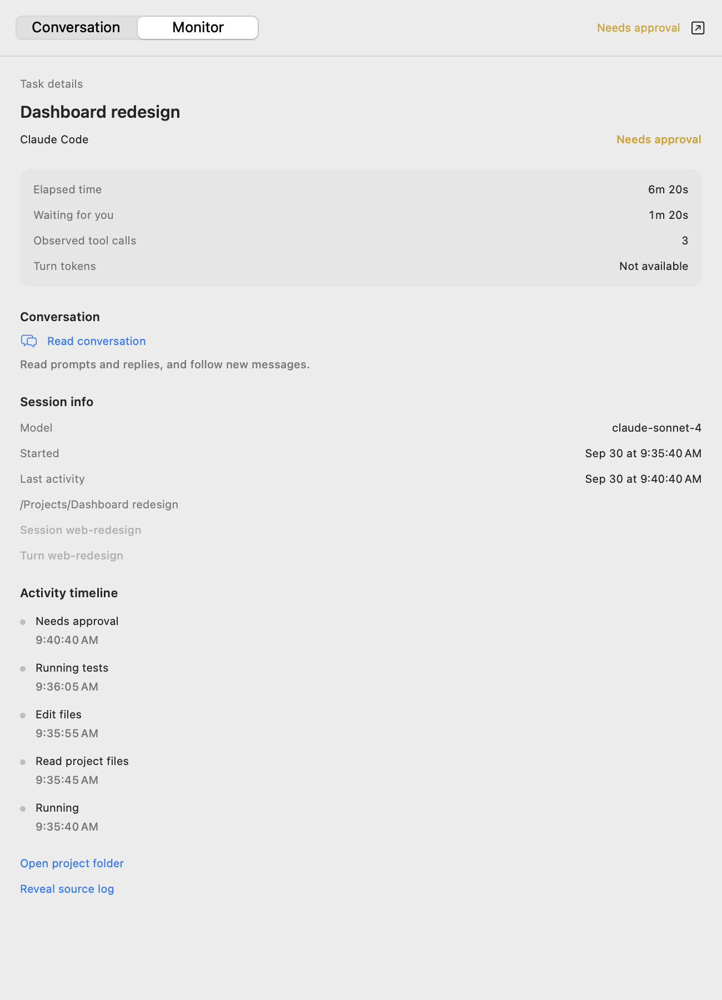
</picture>

### 对比用量与费用

按日、周、月查看趋势，并按 **Agent、模型或中转站** 分组。展示输入／输出 tokens、费用、计费费率和各组占比；上报费用与费率估算分别标注，费率可以本地修改。

<picture>
  <source media="(prefers-color-scheme: dark)" srcset="docs/assets/screenshots/readme-usage-dark.png" />
  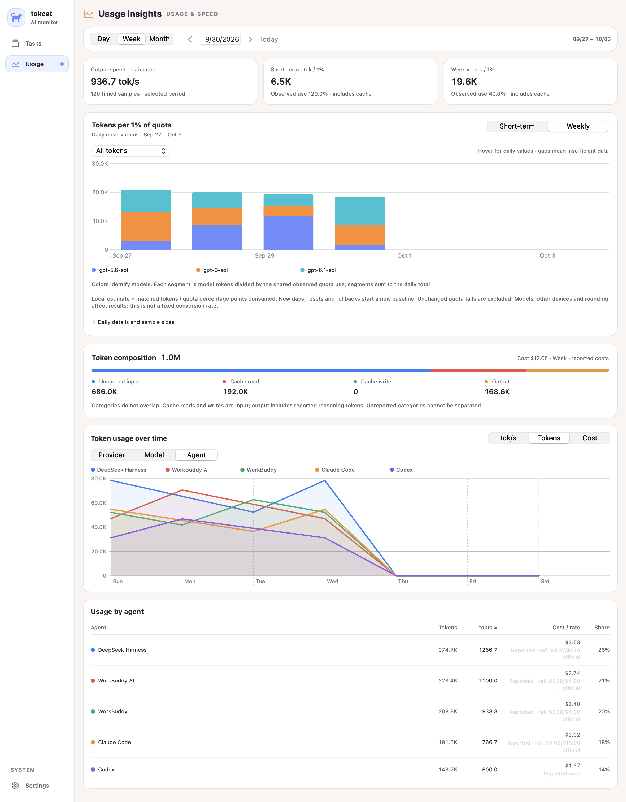
</picture>

<details>
<summary>查看费用视图</summary>

<picture>
  <source media="(prefers-color-scheme: dark)" srcset="docs/assets/screenshots/readme-costs-dark.png" />
  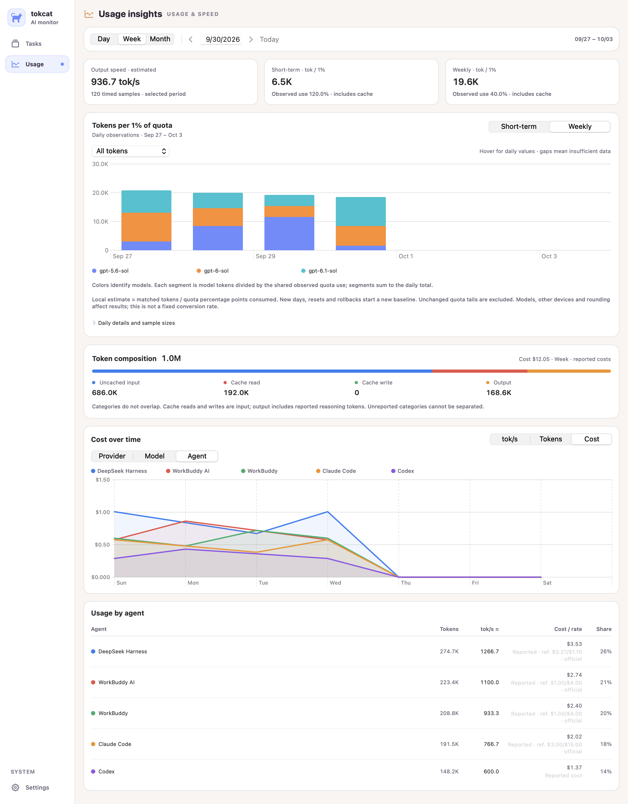
</picture>

CC Switch 可以补充中转站归属、上报费用和计费倍率。Codex 的五小时／每周剩余额度来自客户端写入的本地日志，仅在桌面客户端运行时显示。

</details>

</details>

## 支持的 Agent

Windows 可跟踪 Codex（含 Codex Work）、Claude Code、WorkBuddy 和 DeepSeek Harness 的会话，OpenClaw 和 Kimi 提供活动记录。Windows 上的 Claude Code 状态通过可选 hooks 接入。[Windows 接入说明](windows/README.zh-CN.md)

下表列出 macOS 的接入情况。

<picture>
  <source media="(prefers-color-scheme: dark)" srcset="docs/assets/screenshots/readme-agents-dark.png" />
  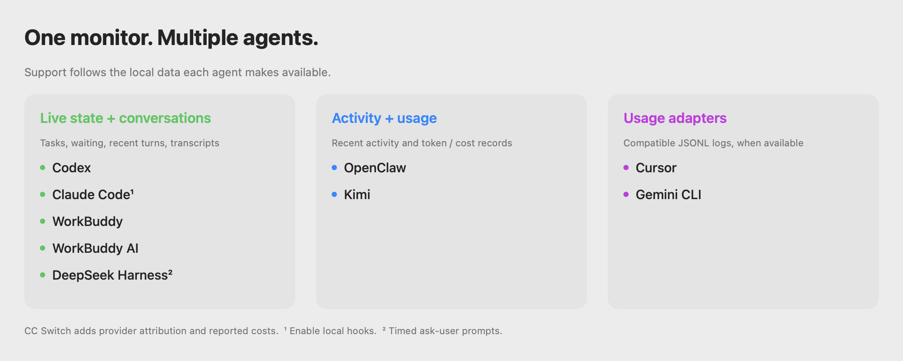
</picture>

| Agent | 实时任务状态 | 最近任务 | 对话阅读 | 用量／费用 |
|---|---|---|---|---|
| **Codex** | 本地生命周期事件 | 按轮次 | ✓ | ✓ |
| **Claude Code** | 自动读取本机会话注册；可选 hooks | ✓ | ✓ | ✓ |
| **WorkBuddy** | 本地数据库状态 | 按会话 | ✓ | ✓ |
| **WorkBuddy AI** | 本地数据库状态 | 按会话 | ✓ | ✓ |
| **DeepSeek Harness** | 本地会话投影状态 | 按会话 | ✓ | ✓ |
| **OpenClaw** | 仅活动记录 | 活动记录 | — | ✓ |
| **Kimi** | 仅活动记录 | 活动记录 | — | ✓ |
| **Cursor** | — | — | — | 兼容 JSONL 日志，可选 |
| **Gemini CLI** | — | — | — | 兼容 JSONL 日志，可选 |

**CC Switch** 是计费集成，补充中转站与上报费用，不提供任务生命周期状态。

Claude Code 有本机会话注册时自动识别运行状态；可选 hooks 补充授权等待、失败和明确的本轮结束，空闲不等于完成。DeepSeek Harness 同时覆盖 `dsh web` 与 DSH Desktop，等待提示需要 Harness 的 **timed ask-user** 模式。Cursor 与 Gemini CLI 默认关闭，需有兼容的本地用量记录。[接入方式与数据源](docs/AgentSupport.md)

状态以本地来源提供的信息为准。日志安静不等于完成，本轮结束不等于整个项目完成。缺少的指标保持不可用，不虚构进度百分比。

## 安装

### 安装 macOS 版

需要 **macOS 13+**。从 [Releases](https://github.com/SelinLee/tokcat/releases) 下载 DMG 或 ZIP，将 `tokcat.app` 放进 Applications。首次打开时右键选择「打开」。当前采用 ad-hoc 签名，尚未进行 Developer ID 公证；0.7.10 安装包为 Apple Silicon 与 Intel Mac 通用构建。

监控仅读取本地记录，无需 API key。用量数据库位于 `~/Library/Application Support/Tokcat/`，任务缓存及可选 Claude hooks 位于 `~/Library/Application Support/TokenCat/`。桌宠与任务监控共用状态来源，升级保留用量历史和监控设置。

### 安装 Windows 版

在 Windows 10 或 11 上，[下载 Windows ZIP](https://github.com/SelinLee/tokcat/releases/download/windows-2026.11.14/tokcat-windows-2026.11.14.zip)，完整解压后双击 `tokcat-windows/Tokcat.cmd`。系统自带的 Windows PowerShell 5.1 即可运行。

**Windows 2026.11.14** 包含赛博轮盘、中文输入法组字即时匹配，以及轮盘停稳时闪烁的修复。在「快速启动 → 通用」选择「赛博轮盘」并保存，按 **Alt + 空格** 即可使用。[更新说明与 SHA-256 校验文件](https://github.com/SelinLee/tokcat/releases/tag/windows-2026.11.14) · [Windows 使用指南](windows/README.zh-CN.md)

## 快速开始

**Windows** · 启动后点击任务栏状态点打开详情窗口，按 **Alt + 空格** 即可搜索应用。要监控 Claude Code，请按 Windows 指南启用 hooks 并重启已有会话。

**macOS**

1. 安装并打开 tokcat，照常使用各个 Agent。
2. 有本机会话注册的 Claude Code 自动显示；如需详细生命周期事件或使用旧版客户端，在「设置 → Agent」启用 hooks，再重启已有 Claude Code 会话。
3. 选择菜单栏指标，通过状态点关注任务；打开「任务总览」阅读对话，或「用量统计」查看趋势。
4. 在「设置 → 桌边挂件」选择 toki／biti 和吸附位置。

## 从源码运行

**Windows** · 从仓库根目录运行 `windows\Tokcat.cmd`。使用 `powershell.exe -NoProfile -File .\windows\Package.ps1` 生成可分发的 ZIP。

**macOS**

```sh
git clone https://github.com/SelinLee/tokcat.git
cd tokcat
swift build
swift test
swift run TokcatApp
```

使用 `bash scripts/package_app.sh` 打包发行文件，产物放在 `dist/`。

| 目录 | 用途 |
|---|---|
| `windows/` | Windows 任务栏监控、快速启动、设置与打包脚本 |
| `App/` | 菜单栏、任务与对话、用量统计和设置 |
| `App/Companion/` | 透明挂件窗口、气泡、滚动动态和吸附 |
| `Sources/TokcatKit/` | 本地适配器、任务生命周期与历史、定价、用量持久化 |
| `Tests/` | 监控、适配器、用量、设置与桌宠回归检查 |
| `scripts/docs_screenshots/` | 可重复生成的原生功能展示图 |

监控配图使用原生视图、示例数据及展示用英文文案，运行框截图保留当前中文界面；不含私人对话，也不代表应用已完整英语本地化。浅色／深色配图跟随 GitHub 主题。[监控配图生成说明](scripts/docs_screenshots/README.md)

[MIT](LICENSE)。桌宠交互参考 [DeepSeek Balance Whale Widget](https://github.com/MeteorNOX/DeepSeek-Balance-Whale-Widget)，toki／biti 图集沿用项目的人物参考。
